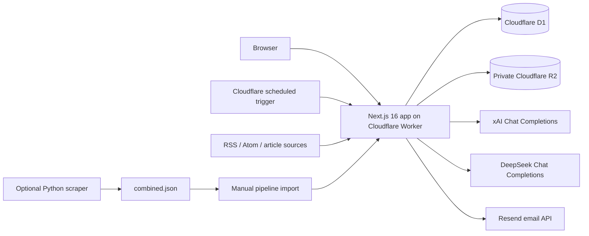

# PressReady website handover

**Prepared:** 19 August 2026 (Hong Kong time)  
**System:** PressReady / `pressready-review`  
**Production URL:** <https://pressready-review.931smd-cloudflare-account.workers.dev>  
**Canonical local repository:** `News-platform/`  
**GitHub repository:** <https://github.com/Hello000123/News-platform>

This document is the operational and technical handover for the PressReady
website. It records the verified state on the preparation date; live counts,
deployment versions, credentials, and provider settings will change over time.
No secret values are included.

## Read this first

The successor should address these items before normal development continues:

1. **Preserve and publish the current source.** The canonical `News-platform/`
   checkout is on `main`, is 14 commits ahead of the freshly fetched
   `origin/main`, and has substantial uncommitted work. GitHub is not currently
   a complete backup of either the committed application or the latest deployed
   state. Do not run `git reset`, `git clean`, or delete any of the three local
   checkouts.
2. **Identify exactly what was deployed.** Production deployment
   `7de4644a-91b6-40cd-9168-f37a593f5d28` was created from a local Wrangler
   deployment without a Git SHA, tag, or message. It cannot be mapped safely to
   a commit from Cloudflare metadata alone.
3. **Transfer service ownership before revoking access.** Confirm successor
   access to GitHub, Cloudflare, Resend, xAI, DeepSeek, billing, and the company
   password manager. Test access from the successor's own account before the
   departing engineer's tokens are revoked.
4. **Handle password-secret rotation carefully.** Production has
   `AUTH_SECRET`, but no separate `PASSWORD_PEPPER` secret. The application
   therefore uses `AUTH_SECRET` as the password pepper. Rotating
   `AUTH_SECRET` now will make all existing password proofs fail. Either set
   `PASSWORD_PEPPER` to the known current `AUTH_SECRET` value before rotating
   `AUTH_SECRET`, or plan coordinated password setup/reset for every account.
5. **Fix the release gate.** `npm test` currently fails during lint because
   generated Wrangler bundles under `.tmp/` are not excluded by ESLint. The
   application source passes lint when `.tmp/**` is ignored.

## Ownership and access checklist

Complete this table before the departure date. Use the company password manager
for credentials; do not paste secrets into this file, email, chat, or tickets.

| Responsibility | Named owner / shared account | Successor confirmed | Notes |
| --- | --- | --- | --- |
| Product and scope decisions | **TBC** | [ ] | Final authority on roadmap and launch readiness |
| Editorial operations | **TBC** | [ ] | Feeds, rewrites, publication, corrections, removals |
| Technical maintenance | **TBC** | [ ] | Repository, tests, deployments, incidents |
| GitHub organisation/repository admin | **TBC** | [ ] | Repository is under `Hello000123` |
| Cloudflare account admin | **TBC** | [ ] | Account: `931SMD Cloudflare Account` |
| Resend account/domain admin | **TBC** | [ ] | Email delivery and sending-domain ownership |
| xAI account/billing owner | **TBC** | [ ] | Grok model key and spend |
| DeepSeek account/billing owner | **TBC** | [ ] | DeepSeek model key and spend |
| Incident contact/channel | **TBC** | [ ] | Include out-of-hours escalation expectations |
| Data protection/contact-request owner | **TBC** | [ ] | D1 account data and private R2 documents |

Current Wrangler authentication is associated with `info@931smd.com`. The
production notification address is configured in `wrangler.jsonc`; confirm it
is monitored and update it when ownership changes.

## What the website does

PressReady combines four related workflows:

- A public newsroom at `/`, `/technology`, `/social-enterprise`, and
  `/news/[id]` for approved articles.
- An authenticated AI review and rewrite workspace at `/review`. Users select
  either the configured Grok or DeepSeek model. Provider credentials remain on
  the server.
- An authenticated editorial pipeline at `/pipeline` for feed/scraper imports,
  AI rewrites, article editing, featured images, categories, publication,
  updates, and removal.
- An employee-only Admin Panel at `/employee` for account approvals, clients,
  employees, client summaries, usage controls/suspensions, and feed settings.

The site also accepts public account applications at `/request-account`.
Employees approve or reject them, and approved clients receive a one-time
password-setup link by email.

### Access model

| Area | Public | Client | Employee |
| --- | ---: | ---: | ---: |
| Read published newsroom pages | Yes | Yes | Yes |
| Request an account / sign in | Yes | Yes | Yes |
| Review and rewrite drafts | No | Yes | Yes |
| Use the editorial pipeline | No | Yes | Yes |
| Edit public-page/article presentation | No | No | Yes |
| Approve, suspend, recover, or remove clients | No | No | Yes |
| Manage feeds and usage thresholds | No | No | Yes |

Mutating authenticated APIs use same-origin checks, session cookies, and CSRF
protection. Employee routes enforce the employee role on the server.

## Architecture



### Main technologies

- Next.js 16 App Router, React 19, and strict TypeScript.
- Cloudflare Workers through `@opennextjs/cloudflare`.
- Cloudflare D1 for accounts, sessions, audits, usage, feeds, pipeline articles,
  rewrite diagnostics, and presentation drafts/published state.
- Private Cloudflare R2 for supporting documents and managed news images.
- xAI and DeepSeek OpenAI-compatible Chat Completions endpoints.
- Resend for account and suspension email.
- Vitest for TypeScript tests; Python `unittest` for the optional scraper.

### Important code locations

| Path | Purpose |
| --- | --- |
| `app/` | Pages and server route handlers |
| `components/` | Auth, employee, newsroom, review, and pipeline UI |
| `lib/server/auth/` | Sessions, password proofs, RBAC, CSRF, email, account lifecycle |
| `lib/server/agents/` | AI provider clients, prompts, review/rewrite workflow, validation |
| `lib/server/feeds/` | Feed ingestion, article repository, popularity, rewrite diagnostics |
| `lib/server/uploads/` | File extraction, validation, R2 storage, news images |
| `lib/shared/` | Zod contracts and shared data models |
| `migrations/` | D1 schema migrations; currently `0001` through `0021` |
| `execution/` | Deterministic Python scraper and `sources.json` |
| `directives/scrape_news.md` | Scraper operations, source-specific failures, and recovery knowledge |
| `scripts/create-employee.mjs` | Local/remote initial employee creation |
| `worker.ts` | OpenNext fetch handler plus scheduled feed ingestion |
| `wrangler.jsonc` | Production Worker, D1, R2, variables, cron, and limits |
| `docs/AUTHENTICATION.md` | Detailed auth, email, and Cloudflare notes |

## Source control and workspace state

### Canonical checkout

Use `News-platform/`. On 19 August 2026 after a fresh `git fetch origin --prune`:

- Branch: `main`
- Local HEAD: `2c5dfdd59642a62e78a34efc358fb450b94eafe6`
- Remote `origin/main`: `f2a0f5786c5a6778731e336035e7225c67b45696`
- Divergence: local is 14 commits ahead and 0 behind
- `feature/replace-picture` points to the same committed HEAD as `main`
- No release tags were found

Before this handover file was added, the working tree had 17 modified tracked
files and one untracked test, totalling approximately 473 added and 42 removed
lines. The work covers rewrite prompts/validation, popularity matching, public
page presentation, source/DNS handling, Cloudflare configuration, tests, and
the scraper directive. The untracked file is
`tests/source-context-default-dns.test.ts`.

Inspect before committing:

```bash
git status --short --branch
git diff --stat
git diff --check
git diff
```

Recommended preservation flow, performed with the departing engineer or after
carefully reviewing every file for secrets:

```bash
git switch -c handover/wip-2026-08-19
git add <reviewed-files-only>
git commit -m "chore: preserve website handover state"
git push -u origin handover/wip-2026-08-19
```

Do not use `git add .` until `.dev.vars`, local exports, and generated files
have been confirmed ignored. Do not force-push this work directly over
`origin/main`; open a pull request and preserve the WIP branch.

### Other local copies

Two other Git checkouts exist beside the canonical one:

- `News-platform-latest/` is on `feature/replace-picture` and has its own dirty
  working tree from an older commit.
- `AI-Agent-News-Review-Rewrite/` is on
  `agent/pressready-editorial-news`, has a different `origin`, an additional
  `news-platform` remote, and also has local changes.

Treat both as historical/working copies until their unique diffs are reviewed.
Do not deploy from them and do not delete them during offboarding.

No `.github` CI/CD workflow was found. Builds, migrations, and deployments are
currently run manually from a developer machine.

## Production inventory and snapshot

Snapshot taken 19 August 2026 at approximately 21:40 HKT.

| Item | Verified value |
| --- | --- |
| Public URL | `https://pressready-review.931smd-cloudflare-account.workers.dev` |
| HTTP check | `200 OK`, private/no-store, security headers present |
| Worker name | `pressready-review` |
| Cloudflare account | `931SMD Cloudflare Account` |
| Active Worker version | `7de4644a-91b6-40cd-9168-f37a593f5d28` at 100% |
| Active deployment | `99542e2e-e8fa-433f-98e7-1316f422e178` |
| Deployment time | 19 Aug 2026 21:32:32 HKT |
| Deployment actor | `info@931smd.com` |
| Previous Worker version | `f11dc00a-2621-43bd-8366-59e0ea3d444e` |
| D1 binding/name | `DB` / `pressready-auth` |
| D1 database ID | `b4865986-9ed1-430a-945a-2675ca22a2ed` |
| D1 migration status | All 21 repository migrations applied; none pending |
| R2 binding/bucket | `ACCOUNT_DOCUMENTS` / `pressready-account-documents` |
| Worker cron | `0 0 * * *` (08:00 HKT daily) |
| D1 feed schedule | Enabled, 1,440-minute interval |
| Last scheduled fetch | 19 Aug 2026 08:00:14 HKT |
| Wrangler version in lockfile/runtime | `4.114.0` |

Non-personal production counts at the snapshot time:

- 17 active feeds.
- 1,682 new pipeline articles, 13 rewritten articles, and 1 approved/live
  article.
- 2 active employee accounts, 1 disabled employee account, and 1 client in
  password-setup-pending state.
- 1 approved account request.

These counts are a dated orientation aid, not monitoring thresholds.

### Configured production secrets

`wrangler secret list` returned these names only:

- `AUTH_SECRET`
- `DEEPSEEK_API_KEY`
- `EMAIL_PROVIDER_API_KEY`
- `XAI_API_KEY`

`PASSWORD_PEPPER` is not configured separately. See the warning at the start of
this document before rotating any authentication secret.

Non-secret production variables are committed in `wrangler.jsonc`. At handover
time the sender is `onboarding@resend.dev`, which Resend restricts to testing
with the account owner's email unless a sending domain is verified. Confirm a
verified company domain and sender before treating public account-request email
as production-ready.

## Local setup

Prerequisites:

- Node.js 22.13 or newer and npm.
- Python 3.12 and Docker only if maintaining the optional scraper.
- Company-managed access to required local development secrets.

```bash
cd "/path/to/news platform (real)/News-platform"
npm ci
cp .env.example .env.local
cp .dev.vars.example .dev.vars
npm run db:migrate:local
npm run dev
```

Open <http://localhost:3000>. `next.config.ts` initializes the OpenNext
Cloudflare development context, and `.dev.vars` supplies local Worker settings.
The real `.dev.vars` and all `.env*` files except examples are ignored by Git.
Transfer values through the password manager rather than copying the existing
file through email or chat.

Useful commands:

```bash
npm run typecheck
npx eslint . --ignore-pattern '.tmp/**'
npm run test:unit
npm run build
npm run preview
npm run create-employee:local
```

The temporary ESLint ignore is needed until `.tmp/**` is added to
`globalIgnores` in `eslint.config.mjs`.

## Deployment runbook

Deploy only from a reviewed, pushed commit. Record its SHA in the change ticket
and deployment message; do not deploy an unidentified dirty worktree.

### Pre-deployment

1. Confirm the intended branch and clean status.
2. Review all schema migrations and decide whether the application remains
   compatible during the migration/deployment interval.
3. Export D1 before a schema or destructive data change:

   ```bash
   mkdir -p .tmp/backups
   npx wrangler d1 export pressready-auth --remote --output .tmp/backups/pressready-auth-2026-08-19T2132.sql
   ```

   Use a new explicit timestamp for each export. The file contains sensitive
   data: keep it out of Git and move it only to approved encrypted storage.
4. Run the release checks:

   ```bash
   npm ci
   npm run typecheck
   npx eslint . --ignore-pattern '.tmp/**'
   npx vitest run --reporter=verbose
   npm run build
   ```

5. Apply migrations and deploy:

   ```bash
   npm run db:migrate:remote
   npm run deploy
   ```

6. Record the Git SHA, Worker version, actor, timestamp, migration numbers, and
   smoke-test result in the release ticket.

### Post-deployment smoke test

- Public homepage, category pages, and the live article load.
- `/login` and `/request-account` load without exposing internal errors.
- An employee can sign in and open `/employee` and `/pipeline`.
- A client is denied employee-only routes.
- Feed schedule and last-fetch time appear correctly in the Admin Panel.
- Review/rewrite and real email checks invoke paid/external services; perform
  them only with an approved test account and budget.
- Confirm current production state:

  ```bash
  npx wrangler deployments status --json
  npx wrangler d1 migrations list pressready-auth --remote
  npx wrangler secret list
  ```

## Rollback and recovery

### Application rollback

List recent versions and roll back to a known version:

```bash
npx wrangler deployments list
npx wrangler rollback <known-good-version-id> --message "Rollback: <incident-id and reason>"
```

The version immediately before the 19 August 21:32 HKT deployment was
`f11dc00a-2621-43bd-8366-59e0ea3d444e`. Verify it is actually compatible with
the current D1 schema before using it; version order alone does not prove it is
safe.

A Worker rollback does **not** undo D1 migrations, D1 data changes, R2 object
changes, emails, or provider requests.

### Database recovery

- Prefer a reviewed SQL repair for a small, understood data issue.
- Use the pre-deployment D1 export for controlled restore work.
- Wrangler also exposes D1 Time Travel:

  ```bash
  npx wrangler d1 time-travel info pressready-auth
  npx wrangler d1 time-travel restore pressready-auth
  ```

Do not run a restore during an active incident without confirming the target
time, expected data loss, retention availability, and business approval. Take a
new export before restoring when possible.

No repository-configured automated D1 export or R2 backup job was found.
Confirm the company's Cloudflare retention/backup policy and add an approved,
encrypted backup process.

## Routine operations

### Feed ingestion

The deployed Worker runs at `00:00 UTC` (08:00 HKT). `worker.ts` checks the
database schedule before ingesting, so both the Worker cron and the Admin Panel
setting matter. At handover time the database schedule is enabled at 1,440
minutes.

Employees manage feeds under `/employee?tab=feeds`. If articles are stale:

1. Check whether the database schedule is enabled and whether the last-fetch
   time advanced.
2. Tail Worker logs during the next run or trigger a controlled manual fetch
   from the Admin Panel.
3. Check the failing source, HTTP status, selector/feed format, and the notes in
   `directives/scrape_news.md`.
4. Leave challenge-protected sources disabled unless a compliant, verified
   retrieval route is available.

There is also a separate Python scraper. Docker runs it once at startup and
then every 30 minutes. A no-upload local run writes
`.tmp/YYYY-MM-DD/combined.json`, which an authenticated user imports in
`/pipeline`:

```bash
python3 -m venv .venv
source .venv/bin/activate
pip install -r requirements.txt
python -m unittest discover -s execution/tests -v
npm run scrape:news
```

`docker compose up -d --build` enables the container schedule. Its optional R2
upload needs separate S3-compatible R2 credentials in `.env`. No evidence was
found that this Docker container or an external host is part of the current
production deployment, so confirm ownership before relying on it.

### Logs and diagnostics

Cloudflare observability is set to `false` in `wrangler.jsonc`. Live Worker logs
can still be tailed while reproducing an issue:

```bash
npx wrangler tail pressready-review --format pretty
```

Pipeline AI rewrites store sanitized diagnostics for 30 days. Use the
pipeline's **Open rewrite debug log** action or the authenticated
`GET /api/pipeline/rewrite-debug?limit=50` endpoint. Logs intentionally omit
source text, generated text, stack traces, and credentials.

### Common incidents

| Symptom | First checks | Escalation / recovery |
| --- | --- | --- |
| Site unavailable or 5xx | `deployments status`, `wrangler tail`, recent deploy/migration | Roll back Worker only after schema-compatibility check |
| AI review/rewrite fails | Selected model, secret name, provider status/billing, rewrite debug ID | Switch to the other allowlisted model if approved; never expose keys in browser/logs |
| Account email fails | Resend status, API secret, sender/domain verification, delivery record | Fix sender/domain; resend setup only from the Admin Panel |
| Login fails for all existing users | Recent `AUTH_SECRET`/`PASSWORD_PEPPER` change, Worker logs | Restore compatible pepper or coordinate new password setup |
| Feeds are stale | Admin schedule, last fetch, source status, Worker logs | Disable broken source; update `sources.json` and directive after a verified fix |
| Incorrect public article | Pipeline publication state and presentation draft/published state | Correct or remove through the authenticated editor; preserve an incident record |
| Unexpected AI spend | Usage events, thresholds, provider dashboard | Suspend affected client, reduce/enable thresholds, rotate compromised provider key |

## Data and security notes

- D1 contains personal account/application data, hashed sessions/tokens,
  password-proof records, audits, usage events, articles, and editorial state.
- R2 is private and contains account supporting documents and managed news
  images under isolated object namespaces.
- Client removal is intentionally permanent and deletes related data. Require
  the built-in confirmation and verify the exact target before proceeding.
- Uploaded files are limited by type/signature and a combined 10 MB boundary.
- Provider keys, Resend credentials, auth secrets, raw session identifiers, and
  setup tokens must never be committed or copied into tickets/logs.
- Public URL retrieval includes SSRF checks but the README documents a DNS
  rebinding time-of-check/time-of-use limitation. Use a resolver-pinning egress
  proxy before treating it as hardened against fully adversarial URLs.
- Consider Cloudflare WAF rate limits/Turnstile for public forms and Cloudflare
  Access as additional protection for employee routes.

## Known issues and technical debt

1. **Source is not fully backed up:** `main` is 14 commits ahead of GitHub and
   the working tree is dirty.
2. **Deployments are not traceable to Git:** latest deployments have no Git SHA,
   tag, or message.
3. **Three divergent local checkouts exist:** only `News-platform/` is the
   canonical handover copy.
4. **No automated CI/CD was found:** release quality depends on manual local
   commands.
5. **Dedicated password pepper is absent:** current fallback couples password
   validity to `AUTH_SECRET` rotation.
6. **Email sender is in Resend test mode:** `onboarding@resend.dev` is not a
   general production sender.
7. **Observability is disabled:** there is no repository-configured persistent
   Cloudflare application log setup.
8. **`npm test` release script is currently broken:** ESLint scans `.tmp/`
   Wrangler bundles and reaches `Maximum call stack size exceeded`. Add
   `.tmp/**` to `globalIgnores`.
9. **The entire Vitest run is slow/silent:** two bounded full-suite attempts
   were stopped after several minutes. The critical authentication file and
   all tests covering current modified areas pass independently; investigate
   suite scheduling/open handles and establish a CI timeout.
10. **Scraper test environment is not installed:** the current machine has no
    `.venv`, and system Python lacks `beautifulsoup4`. Create the documented
    venv and install `requirements.txt` before testing.
11. **Documentation drift exists:** the README introduction says publishing and
    scheduled work are absent, while both now exist. `docs/AUTHENTICATION.md`
    also describes the public site as future work. Update these sections after
    the current WIP is committed.
12. **No automated D1/R2 backup workflow was found.** Define retention,
    encrypted exports, restore testing, and ownership.
13. **No custom production domain is configured in the repository:** users
    currently rely on the `workers.dev` URL.

## Verification performed for this handover

Performed on 19 August 2026:

- Fetched `origin` successfully and confirmed the 14-commit divergence.
- Confirmed production homepage returns `HTTP 200` with no-store and security
  headers.
- Confirmed active Cloudflare deployment/version and actor.
- Confirmed all remote D1 migrations are applied.
- Confirmed the R2 bucket and production secret **names** without retrieving
  values.
- Queried only non-personal production counts and feed schedule state.
- `npm run typecheck`: passed.
- `npx eslint . --ignore-pattern '.tmp/**'`: passed.
- `npm run build`: passed (Next.js production build and route generation).
- Focused current-change suite: 8 test files, 136 tests passed.
- Authentication integration suite: 1 file, 13 tests passed.
- `npm test`: did not complete because the lint step failed on three generated
  `.tmp/` Wrangler bundles.
- Full Vitest suite: not claimed as passed; bounded runs were stopped after
  prolonged silence.
- Python scraper tests: not run successfully because the project venv and
  `beautifulsoup4` dependency are not installed on this machine.

## Departure-day checklist

- [ ] Complete the ownership table and verify successor logins.
- [ ] Preserve, review, commit, and push the canonical WIP on a safety branch.
- [ ] Open a pull request for the 14 local commits and uncommitted changes.
- [ ] Record which Git commit matches—or most closely matches—the live Worker.
- [ ] Transfer GitHub, Cloudflare, Resend, xAI, DeepSeek, billing, and password
      manager ownership.
- [ ] Verify at least two company-controlled Cloudflare administrators exist.
- [ ] Decide the `PASSWORD_PEPPER` migration/reset plan before any secret
      rotation.
- [ ] Configure and test a verified Resend sending domain.
- [ ] Export D1 to approved encrypted storage and document retention.
- [ ] Decide and test the R2 backup/retention approach.
- [ ] Fix the ESLint `.tmp/**` ignore and run the complete release suite.
- [ ] Add CI/CD with commit-linked deployments and protected production
      approvals.
- [ ] Test Worker rollback and D1 recovery in a non-production environment.
- [ ] Update stale README/authentication documentation.
- [ ] Revoke the departing engineer's personal tokens/sessions only after the
      successor confirms independent access.

