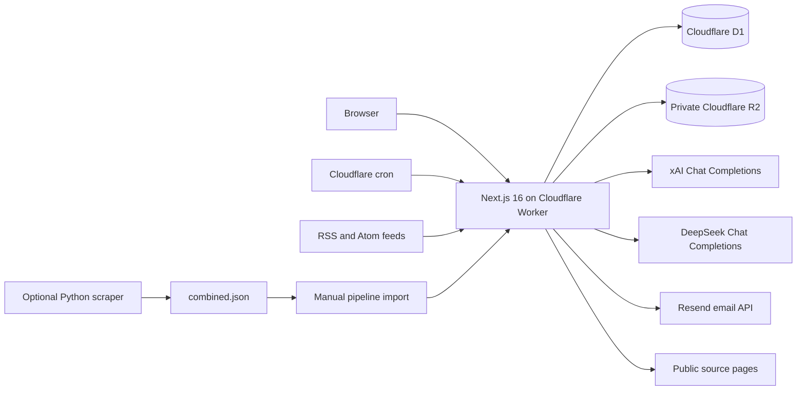

# PressReady website handover: expanded technical and operational reference

**Prepared:** 19 August 2026, Hong Kong time  
**System:** PressReady / Cloudflare Worker `pressready-review`  
**Production URL:** <https://pressready-review.931smd-cloudflare-account.workers.dev>  
**Canonical local checkout:** `News-platform/`  
**GitHub repository:** <https://github.com/Hello000123/News-platform>  
**Source document:** [PressReady website handover](WEBSITE_HANDOVER.md)  
**Non-technical companion:** [PressReady simple step-by-step guide](WEBSITE_HANDOVER_PLAIN_LANGUAGE.md)

This document expands the original verified handover into a long-form reference
for technical maintainers, operations staff, security and data owners,
editorial employees, managers, and incident responders. It describes the
application as it existed on 19 August 2026. It is not a guarantee that live
provider settings, data counts, deployment identifiers, billing state, or user
access remain unchanged after that date.

No secret values are included. Names of environment variables, service
bindings, account identifiers, database identifiers, and public addresses are
included where they are needed to operate or recover the system. Store actual
passwords, API keys, one-time links, session identifiers, private documents,
and database exports only in approved company systems.

## Document purpose and reading order

Use this document for:

- Company offboarding and ownership transfer.
- Technical onboarding of a new maintainer.
- Routine operation of accounts, feeds, publishing, and AI features.
- Local development and testing.
- Production release planning and verification.
- Incident triage, rollback, and data-recovery decisions.
- Security, privacy, backup, audit, and vendor-management reviews.
- Preservation of the current local source before the departing engineer's
  workstation or access is changed.

Recommended reading order:

1. Read **Critical warnings** and **First 24 hours** before doing anything.
2. Complete **Ownership, access, and escalation** with real names.
3. Read **Source control and preservation** before touching any local folder.
4. Read the relevant workflow section before operating an account, feed,
   article, deployment, secret, database, or backup.
5. During an incident, begin with the matching incident playbook and then use
   the deployment, rollback, database, or security detail it references.
6. Use the appendices for API routes, migrations, commands, and terminology.

## Evidence and confidence labels

Statements in this document fall into four categories:

| Label | Meaning |
| --- | --- |
| Verified repository fact | Read directly from the current canonical checkout, Git state, configuration, migration, or test output |
| Verified production snapshot | Queried from production on 19 August 2026 and valid only at that recorded time |
| Documented operational behavior | Supported by current source and tests, but should still be checked in the live interface after future changes |
| Required company decision | Cannot be determined from code and must be supplied by management, legal/privacy, finance, or the successor |

Do not convert a dated snapshot into a permanent assumption. Re-query
production before releases, incidents, migrations, restores, security changes,
or spend decisions.

## Executive summary

PressReady is a Next.js 16 and React 19 application deployed to Cloudflare
Workers using OpenNext. It combines a public news site, an authenticated AI
review/rewrite workspace, an authenticated editorial pipeline, and an
employee-only administration area.

Cloudflare D1 stores accounts, sessions, approvals, email-delivery metadata,
rate limits, AI usage, feeds, pipeline articles, rewrite diagnostics,
presentations, and client summaries. A private Cloudflare R2 bucket stores
account-request attachments and managed article or presentation images. xAI
and DeepSeek provide the two allowlisted AI models. Resend provides outbound
account and suspension email.

The application is functional and the focused areas changed in the working
tree pass their tests. The most serious offboarding risk is source preservation:
the canonical local `main` branch is 14 commits ahead of GitHub and also has
substantial uncommitted work. Production cannot be safely reconstructed from
the current GitHub default branch alone.

The second major risk is authentication-secret coupling. Production contains
`AUTH_SECRET` but no separately configured `PASSWORD_PEPPER`. The code falls
back to using `AUTH_SECRET` as the password pepper. Rotating `AUTH_SECRET`
without a migration or coordinated password reset will invalidate existing
password proofs.

The third major risk is release and recovery maturity. No repository CI/CD,
automated D1/R2 backup workflow, commit-linked deployment metadata, persistent
Cloudflare observability configuration, or verified custom production domain
was found. Releases and important recovery tasks are manual.

## Critical warnings

### 1. Preserve all source before cleanup or access revocation

Do not run `git reset`, `git clean`, destructive checkout commands, force-push,
or folder deletion in any of these checkouts:

- `News-platform/`
- `News-platform-latest/`
- `AI-Agent-News-Review-Rewrite/`

Use `News-platform/` as the canonical starting point, but preserve and compare
all three because each has local state.

### 2. Do not deploy an unidentified working tree

The production Worker version recorded in the snapshot has no trustworthy Git
SHA, tag, or deployment message. Do not make the traceability problem worse by
deploying another dirty or unpushed working tree. Every future deployment must
record the reviewed commit SHA, branch, actor, Worker version, deployment ID,
migrations, and smoke-test result.

### 3. Do not rotate `AUTH_SECRET` casually

The current fallback behavior is:

```text
PASSWORD_PEPPER configured and at least 32 characters
    -> use PASSWORD_PEPPER
otherwise
    -> use AUTH_SECRET
```

Production did not list `PASSWORD_PEPPER` as a separate secret at the snapshot
time. Before rotating `AUTH_SECRET`, either preserve the current effective
pepper in a separately managed `PASSWORD_PEPPER`, or coordinate password setup
again for all accounts. Perform this with security review and a tested rollback
plan.

### 4. Client removal is permanent

Suspension retains the account and data. Removal deletes the client and related
server data. Use suspension for temporary or uncertain cases. Require explicit
business and data-owner approval before removal.

### 5. Database restore is not an ordinary rollback

Rolling back a Worker does not roll back D1 migrations, D1 data, R2 objects,
email, or AI-provider requests. D1 restore can discard legitimate writes after
the chosen restore point. Confirm the target time, expected data loss, current
backup, schema compatibility, authority, and communication plan first.

### 6. External-service checks may cost money or send real messages

Real AI calls consume provider credits. Real Resend checks send email. Remote
D1 operations and deployments change production. Do not use them as routine
documentation tests without approved accounts, recipients, budget, timing, and
authority.

### 7. `npm test` is not currently a reliable single-command release gate

Generated Wrangler output under `.tmp/` is scanned by ESLint and can cause a
maximum-call-stack failure. The documented temporary lint command explicitly
ignores `.tmp/**`. Fix `eslint.config.mjs`, then re-establish a complete bounded
suite in CI.

## First 24 hours of the handover

Complete these tasks in order:

1. Freeze destructive cleanup of all three local checkouts.
2. Copy this document, the original handover, and the plain-language guide to
   the approved handover record.
3. Assign named owners for product, editorial, technical, GitHub, Cloudflare,
   Resend, xAI, DeepSeek, finance, security, privacy, backups, and incidents.
4. Have successors sign in using their own company accounts and record the
   exact project or workspace they can access.
5. Create a reviewed safety branch from `News-platform/`, preserve the 14 local
   commits, review uncommitted changes for secrets, and push them through a
   pull request.
6. Inventory unique changes in the two other checkouts before archiving or
   removing either one.
7. Record which reviewed commit most closely matches the live Worker version.
8. Export D1 to approved encrypted storage and document retention. Do not put
   the export in Git.
9. Confirm R2 backup or retention expectations and ownership.
10. Decide the `PASSWORD_PEPPER` migration or password-reset approach before
    revoking or rotating any authentication secret.
11. Confirm the Resend sender/domain plan; the recorded production sender is a
    testing address.
12. Run the public and authenticated smoke checks from the successor's account.
13. Revoke the departing engineer's personal access only after independent
    successor access and recovery paths are confirmed.

## Ownership, access, and escalation

### Ownership register

Complete every `TBC` before departure. Do not include credentials.

| Domain | Accountable owner | Operational owner | Backup owner | Access tested | Evidence / internal record |
| --- | --- | --- | --- | --- | --- |
| Product scope and launch decisions | **TBC** | **TBC** | **TBC** | [ ] | **TBC** |
| Editorial standards, publishing, corrections | **TBC** | **TBC** | **TBC** | [ ] | **TBC** |
| Application maintenance | **TBC** | **TBC** | **TBC** | [ ] | **TBC** |
| GitHub organization and repository | **TBC** | **TBC** | **TBC** | [ ] | **TBC** |
| Cloudflare account and billing | **TBC** | **TBC** | **TBC** | [ ] | **TBC** |
| D1 database ownership and recovery | **TBC** | **TBC** | **TBC** | [ ] | **TBC** |
| R2 private-file ownership and retention | **TBC** | **TBC** | **TBC** | [ ] | **TBC** |
| Resend account, domain, and billing | **TBC** | **TBC** | **TBC** | [ ] | **TBC** |
| xAI account, key, limits, and billing | **TBC** | **TBC** | **TBC** | [ ] | **TBC** |
| DeepSeek account, key, limits, and billing | **TBC** | **TBC** | **TBC** | [ ] | **TBC** |
| Password manager and recovery process | **TBC** | **TBC** | **TBC** | [ ] | **TBC** |
| Security incident response | **TBC** | **TBC** | **TBC** | [ ] | **TBC** |
| Privacy/data-subject requests | **TBC** | **TBC** | **TBC** | [ ] | **TBC** |
| Backup verification and restore testing | **TBC** | **TBC** | **TBC** | [ ] | **TBC** |
| Out-of-hours escalation | **TBC** | **TBC** | **TBC** | [ ] | **TBC** |

### Access-transfer acceptance test

For each external service:

1. Successor signs in from their own device using their own company identity.
2. Successor confirms the correct organization, account, team, and project.
3. Successor verifies the minimum required role.
4. A second company administrator confirms recovery access where supported.
5. Billing and security notifications are redirected to monitored company
   addresses.
6. Personal recovery addresses and departing-employee devices are removed only
   after company recovery works.
7. Result, date, actor, and internal evidence link are recorded.

Current Wrangler authentication was associated with `info@931smd.com`. Treat
this as a dated observation, not proof of durable shared ownership.

### Escalation record

| Severity | Example | Initial response target | Decision-maker | Technical lead | Communication channel |
| --- | --- | --- | --- | --- | --- |
| Critical | Site unavailable, suspected breach, destructive data incident | **TBC** | **TBC** | **TBC** | **TBC** |
| High | Login outage, widespread publishing failure, uncontrolled AI spend | **TBC** | **TBC** | **TBC** | **TBC** |
| Medium | One provider unavailable, feed backlog, email-delivery failure | **TBC** | **TBC** | **TBC** | **TBC** |
| Low | Cosmetic defect, one paused feed, documentation correction | **TBC** | **TBC** | **TBC** | **TBC** |

## Product scope and user journeys

### Public newsroom

Public visitors can read:

- `/` — homepage.
- `/technology` — Technology category archive.
- `/social-enterprise` — Social Enterprise category archive.
- `/news` — news index route.
- `/news/[id]` — published article page.
- `/request-account` — account application.
- `/request-submitted` — application confirmation.
- `/login` — sign-in entry.
- `/setup-password` and `/invalid-setup-link` — approved-account setup flow.

Only articles in approved/live state are intended for the public newsroom.
Presentation records can alter text styling and image geometry without changing
the locked page topology.

### AI review and rewrite workspace

Authenticated clients and employees use `/review` to:

1. Submit draft text, a public source URL, or supported uploaded-file text.
2. Select Grok 4.5 or DeepSeek V4 Pro.
3. Request one structured writing review.
4. Read the score, readiness band, findings, strengths, missing information,
   and recommendations.
5. Explicitly request a rewrite; review never auto-starts a rewrite.
6. Request later refinements with concise/more-detailed preference and optional
   instructions.

The current browser session stores the active source and successful rewrite
turns in tab-scoped session storage. It is not an account-level article-history
system.

### Editorial pipeline

Authenticated clients and employees use `/pipeline` to:

- Browse feed and scraper imports.
- Filter by new, rewritten, approved, discarded, or all.
- Retrieve or inspect saved full source text.
- Group popular coverage from independent sources.
- Generate AI rewrites with related-report evidence.
- Edit headline, body, category, and featured image.
- Save a draft, publish, update, unpublish, or discard.
- Open sanitized rewrite diagnostics after failures.

Employees additionally control public presentation editing. The publishing
workflow remains human-controlled even when AI creates a draft.

### Employee administration

Employees use `/employee` and related detail pages. Current tabs are:

- **Account Approval** — pending, approved, rejected, and all requests.
- **Client Accounts** — accounts, AI usage, suspension, recovery, removal.
- **Client Overview** — aggregated company-type distribution.
- **Employee Accounts** — employee account view.
- **News Feeds** — feed CRUD, manual fetch, pause/resume, schedule.

Client detail pages can show published items and generated company summaries.
Company summaries use up to 50 published articles with up to 1,500 characters
of body evidence per article; they are generated through an AI provider and
must not be treated as verified corporate profiles.

## Roles and authorization matrix

| Capability | Public | Client | Employee |
| --- | ---: | ---: | ---: |
| Read approved public pages | Yes | Yes | Yes |
| Submit an account request | Yes | Yes | Yes |
| Sign in and sign out | No account required for page; valid account required for session | Yes | Yes |
| Review and rewrite drafts | No | Yes | Yes |
| Extract supported upload text | No | Yes | Yes |
| View and edit pipeline items | No | Yes | Yes |
| Publish or unpublish pipeline articles | No | Yes | Yes |
| Edit article/public-page presentation | No | No | Yes |
| View account-request attachments | No | No | Yes |
| Approve/reject/resend setup | No | No | Yes |
| View all client and employee accounts | No | No | Yes |
| Suspend/recover/remove clients | No | No | Yes |
| Configure AI usage suspension rules | No | No | Yes |
| Manage feeds and feed schedule | No | No | Yes |
| Generate/view client company summaries | No | No | Yes |

Server routes enforce role checks; hiding a button in the browser is not the
authorization boundary. Mutating authenticated APIs also use same-origin and
CSRF protections.

## System architecture



### Request and data boundaries

```mermaid
flowchart TD
    Public[Public user] --> PublicPages[Public routes]
    Applicant[Applicant] --> RequestAPI[Account request API]
    Client[Client browser] --> AuthAPI[Authenticated client APIs]
    Employee[Employee browser] --> EmployeeAPI[Employee-only APIs]
    PublicPages --> D1
    RequestAPI --> D1
    RequestAPI --> R2
    RequestAPI --> Resend
    AuthAPI --> D1
    AuthAPI --> R2
    AuthAPI --> AI[Selected AI provider]
    EmployeeAPI --> D1
    EmployeeAPI --> R2
    EmployeeAPI --> Resend
    EmployeeAPI --> AI
```



### Technology inventory

| Layer | Technology | Current role |
| --- | --- | --- |
| Web framework | Next.js 16 App Router | Pages, route handlers, rendering, headers |
| UI runtime | React 19 | Client interaction and server-rendered UI |
| Language | TypeScript 5.9, strict configuration | Application and test code |
| Edge packaging | `@opennextjs/cloudflare` 1.20.2 | Builds Next.js for Cloudflare Workers |
| Hosting/runtime | Cloudflare Workers | Fetch handler, assets, scheduled handler |
| Database | Cloudflare D1 | Relational application state |
| Object storage | Cloudflare R2 | Private documents and managed images |
| Validation | Zod 4.4 | Request, provider-response, and shared-contract validation |
| Compression/archive | `fflate` | Safe Office archive extraction |
| PDF extraction | `unpdf` | Bounded PDF text extraction |
| Password derivation | `scrypt-js` in browser; compatible server crypto | Client proof and server verification flow |
| AI providers | xAI and DeepSeek Chat Completions | Review, rewrite, image analysis, client summary |
| Email | Resend-compatible HTTP API | Account and client lifecycle email |
| Unit/integration tests | Vitest 4.1, Testing Library, Miniflare | Contracts, routes, UI, D1/Worker behavior |
| Scraper | Python 3.12, requests, Beautiful Soup, feedparser, boto3 | Optional external article collection |
| Container schedule | Docker plus cron | Optional 30-minute scraper job |

### Cloudflare runtime configuration

- Worker name: `pressready-review`.
- Entry point: `worker.ts`.
- Compatibility date: `2026-07-28`.
- Compatibility flags: `nodejs_compat`, `global_fetch_strictly_public`.
- Static asset binding: `ASSETS` from `.open-next/assets`.
- D1 binding: `DB`.
- R2 binding: `ACCOUNT_DOCUMENTS`.
- Cron expression: `0 0 * * *`.
- CPU limit: 30,000 ms.
- Subrequest limit: 1,000.
- Minification: enabled.
- Observability: disabled in repository configuration.

The custom scheduled handler checks `feed_schedule_settings` before ingestion.
If the row is absent, disabled, or not due, it logs a skip and returns. On a due
run it ingests active feeds, updates `last_auto_fetch_at`, and logs total parsed,
added, and failed counts. Errors are caught and written to Worker logs rather
than propagating out of the scheduled handler.

## Repository and codebase map

### Canonical locations

| Path | Responsibility |
| --- | --- |
| `app/` | App Router pages and HTTP route handlers |
| `components/` | UI grouped around authentication, review, pipeline, employee, and public-news experiences |
| `lib/client/` | Typed browser API clients, password-proof work, file upload, rewrite localization/session logic |
| `lib/server/agents/` | Provider clients, prompts, review/rewrite agents, model routing, quotation validation |
| `lib/server/auth/` | Configuration, database access, account lifecycle, sessions, rate limiting, usage controls, email |
| `lib/server/feeds/` | Feed parsing, retrieval, repository, popularity grouping, pipeline, rewrite diagnostics |
| `lib/server/sources/` | Public URL validation, DNS checks, redirects, bounded retrieval, source extraction |
| `lib/server/uploads/` | File validation/extraction, image analysis, storage, managed news images |
| `lib/server/` | Cross-cutting errors, HTTP handling, presentation, summaries, overview |
| `lib/shared/` | Zod contracts, shared types, models, categories, presentation schemas |
| `migrations/` | Ordered D1 migrations `0001` through `0021` |
| `tests/` | Unit, component, route, D1/Miniflare integration, calibration, and live evaluation assets |
| `execution/` | Deterministic Python scraper and source definitions |
| `directives/` | Operational scraper SOP and accumulated source-specific knowledge |
| `scripts/` | Interactive local/remote employee creation |
| `docs/` | Authentication, handover, design research, and test documentation |
| `worker.ts` | OpenNext fetch handler plus Cloudflare scheduled ingestion |
| `wrangler.jsonc` | Worker, D1, R2, variables, limits, assets, and cron configuration |
| `next.config.ts` | Next.js behavior, security headers, development-origin discovery |
| `package.json` | Node version, dependencies, scripts, release/test commands |
| `docker-compose.yml`, `Dockerfile`, `entrypoint.sh`, `crontab` | Optional scraper container and schedule |

### Page map

| Route | Audience | Purpose |
| --- | --- | --- |
| `/` | Public | Newsroom homepage |
| `/technology` | Public | Technology archive |
| `/social-enterprise` | Public | Social Enterprise archive |
| `/news` | Public | News index |
| `/news/[id]` | Public | Published article |
| `/login` | Public entry | Authentication form |
| `/request-account` | Public | Account application |
| `/request-submitted` | Public | Application confirmation |
| `/setup-password` | Approved applicant | One-time password setup |
| `/invalid-setup-link` | Public | Invalid/expired/reused setup-link explanation |
| `/access-denied` | Authenticated/public redirect target | Insufficient-role result |
| `/review` | Client/employee | AI review and rewrite workspace |
| `/pipeline` | Client/employee | Editorial intake, rewrite, editing, publishing |
| `/employee` | Employee | Main Admin Panel |
| `/employee/requests/[id]` | Employee | Account-request details and decision |
| `/employee/clients/[id]` | Employee | Client detail, published items, summary |

### Important shared limits and contracts

| Limit | Current value | Source/purpose |
| --- | ---: | --- |
| Draft text | 50,000 characters | Review/rewrite contract |
| Source/reference text | 50,000 characters | Immutable source snapshot and evidence |
| HTTP request body | 220,000 bytes | General review/rewrite request guard |
| Public source URL | 2,048 characters | URL contract |
| Image-context entries | 8 | Extracted linked-image captions/context |
| Rewrite instruction | 4,000 characters | User refinement instruction |
| Rewrite history | 24 entries | In-request refinement history |
| Feed name | 120 characters | Feed contract |
| Feed/article URL | 2,048 characters | Feed and pipeline contract |
| Pipeline title | 1,000 characters | Imported/public headline bound |
| Pipeline description | 20,000 characters | Imported metadata |
| Pipeline author | 500 characters | Imported author field |
| Pipeline rewritten text | 50,000 characters | Saved output |
| Related article IDs | 200 | Popularity/rewrite evidence selection |
| Rewrite debug query | Up to 100 rows | Diagnostic listing |
| Uploaded file count | 50 | One submission |
| Uploaded file total | 10 MiB combined | Account and extraction upload boundary |
| PDF pages | 250 | Extraction safety limit |
| Office archive entries | 5,000 | Zip-bomb/complexity defense |
| Office expanded total | 50 MiB | Extraction safety limit |
| Office single expanded entry | 16 MiB | Extraction safety limit |
| Extraction timeout | 30 seconds | PDF/Office/image processing |

## Source control and preservation

### Verified canonical checkout state

As verified on 19 August 2026:

- Checkout: `News-platform/`.
- Branch: `main`.
- Local HEAD: `2c5dfdd59642a62e78a34efc358fb450b94eafe6`.
- Remote `origin/main`: `f2a0f5786c5a6778731e336035e7225c67b45696`.
- Divergence: local 14 commits ahead, 0 behind.
- `feature/replace-picture` points to the same committed HEAD as local `main`.
- No release tags were found.
- Remote: `https://github.com/Hello000123/News-platform.git`.

Before handover documents were added, the working tree contained 17 modified
tracked files and one untracked test, approximately 473 additions and 42
deletions. Existing changes cover:

- Homepage and category rendering.
- Scraper recovery knowledge.
- AI prompts and rewrite-agent behavior.
- Popularity grouping.
- Public-page presentation persistence.
- Source-context DNS behavior.
- Cloudflare configuration.
- Focused tests for those areas.

The untracked application test is
`tests/source-context-default-dns.test.ts`.

### Modified tracked files at handover

- `components/news/category-page-content.tsx`
- `components/news/homepage-content.tsx`
- `directives/scrape_news.md`
- `lib/server/agents/prompts.ts`
- `lib/server/agents/rewrite-agent.ts`
- `lib/server/feeds/popularity.ts`
- `lib/server/public-page-presentation.ts`
- `lib/server/sources/source-context.ts`
- `lib/shared/public-page-presentation.ts`
- `tests/homepage-content.test.tsx`
- `tests/popularity.test.ts`
- `tests/prompts.test.ts`
- `tests/public-page-editing.test.tsx`
- `tests/public-page-presentation.test.ts`
- `tests/relaxed-fidelity.test.ts`
- `tests/workflow.test.ts`
- `wrangler.jsonc`

### Other local checkouts

`News-platform-latest/` is a separate dirty checkout from an older commit and
was on `feature/replace-picture`. `AI-Agent-News-Review-Rewrite/` is another
dirty checkout on `agent/pressready-editorial-news`; it has a different origin
and an additional `news-platform` remote. Neither is authorized as a deployment
source until its unique history and working tree have been compared.

### Preservation procedure

Run read-only checks first:

```bash
git status --short --branch
git remote -v
git branch -vv
git log --oneline --decorate --graph --all
git diff --stat
git diff --check
git diff
```

Then, after reviewing every file for secrets and generated/private data:

```bash
git switch -c handover/wip-2026-08-19
git add <explicit-reviewed-file-1> <explicit-reviewed-file-2>
git diff --cached --check
git diff --cached
git commit -m "chore: preserve website handover state"
git push -u origin handover/wip-2026-08-19
```

Open a pull request and record:

- Source branch.
- Commit SHA.
- Reviewer.
- Deliberately excluded files and reasons.
- Secret-scan or manual secret-review result.
- Relationship to the current production Worker version.
- Follow-up issues for incomplete tests, documentation, and deployment safety.

Do not use `git add .` until `.dev.vars`, local exports, `.tmp`, generated
OpenNext output, and other sensitive/generated files have been confirmed
ignored. Do not force-push over `origin/main`.

### Repository hygiene observations

- No `.github` CI/CD workflow was found.
- Local `.env*` files are ignored except examples.
- `.dev.vars` is ignored; `.dev.vars.example` is the template.
- `.tmp/` is ignored by Git but not currently ignored by ESLint.
- `.DS_Store` and a Python `__pycache__` were observed locally; they are not
  part of the intended application design and should remain excluded.
- `.open-next/`, `.next/`, coverage, caches, and Wrangler state are generated.

## Production inventory and dated snapshot

Snapshot time: approximately 21:40 HKT on 19 August 2026.

| Item | Verified value at snapshot |
| --- | --- |
| Public URL | `https://pressready-review.931smd-cloudflare-account.workers.dev` |
| Homepage response | HTTP 200; no-store/private behavior and security headers present |
| Worker name | `pressready-review` |
| Cloudflare account | `931SMD Cloudflare Account` |
| Account ID in configuration | `d795f2f2ac58af5e123b27097f1f9766` |
| Active Worker version | `7de4644a-91b6-40cd-9168-f37a593f5d28`, 100% |
| Active deployment | `99542e2e-e8fa-433f-98e7-1316f422e178` |
| Deployment time | 19 Aug 2026 21:32:32 HKT |
| Deployment actor | `info@931smd.com` |
| Previous Worker version | `f11dc00a-2621-43bd-8366-59e0ea3d444e` |
| D1 binding/name | `DB` / `pressready-auth` |
| D1 database ID | `b4865986-9ed1-430a-945a-2675ca22a2ed` |
| D1 migrations | All repository migrations `0001`–`0021` applied; none pending |
| R2 binding/bucket | `ACCOUNT_DOCUMENTS` / `pressready-account-documents` |
| Worker cron | `0 0 * * *` = 08:00 HKT daily |
| D1 feed schedule | Enabled, 1,440-minute interval |
| Last scheduled fetch | 19 Aug 2026 08:00:14 HKT |
| Wrangler version | 4.114.0 |

Non-personal counts at the snapshot:

- 17 active feeds.
- 1,682 pipeline articles in new state.
- 13 rewritten pipeline articles.
- 1 approved/live article.
- 2 active employees.
- 1 disabled employee.
- 1 client in password-setup-pending state.
- 1 approved account request.

These counts are orientation data, not expected steady-state thresholds. Re-run
approved queries when current counts matter, and avoid exposing personal rows
in handover or incident tickets.

### Production traceability gap

Cloudflare metadata did not provide a reliable Git SHA, tag, or useful message
for the recorded active version. The previous version ID is not automatically a
safe rollback target; its schema and behavior must be checked against current
D1 migrations first.

## Configuration and environment variables

### Configuration sources and precedence

The application reads configuration from Node environment variables and, for
selected Worker secrets such as authentication values, from the Cloudflare
runtime context. Local Next.js development commonly uses `.env.local`.
OpenNext/Workerd preview uses `.dev.vars`. Production non-secret variables are
committed in `wrangler.jsonc`, while secret values are stored through
Cloudflare secret management.

Never add `NEXT_PUBLIC_` to a secret. Browser-prefixed variables are exposed to
client code.

### AI configuration

| Variable | Required | Default / bound | Purpose |
| --- | --- | --- | --- |
| `XAI_API_KEY` | When Grok is used | No safe production default | Server-only xAI credential |
| `DEEPSEEK_API_KEY` | When DeepSeek is used | No safe production default | Server-only DeepSeek credential |
| `AI_MODEL` | Optional | `grok-4.5` | Initial allowlisted model |
| `REVIEW_PASS_SCORE` | Optional | 80, bounded 0–100 | Review pass label threshold |
| `XAI_API_BASE_URL` | Optional | `https://api.x.ai/v1` | xAI endpoint base |
| `XAI_TIMEOUT_MS` | Optional | 600,000; bounded 1,000–600,000 | xAI request timeout |
| `XAI_STREAM` | Optional | `true` | Upstream streaming toggle |
| `DEEPSEEK_API_BASE_URL` | Optional | `https://api.deepseek.com` | DeepSeek endpoint base |
| `DEEPSEEK_TIMEOUT_MS` | Optional | 600,000; bounded 1,000–600,000 | DeepSeek request timeout |
| `DEEPSEEK_STREAM` | Optional | `true` | Upstream streaming toggle |

Only `grok-4.5` and `deepseek-v4-pro` are accepted. Invalid browser-supplied
model IDs are rejected. Invalid default model configuration falls back to
Grok 4.5. Both provider clients use high reasoning effort and intentionally do
not expose a reasoning trace.

### Authentication and email configuration

| Variable | Required | Default / bound | Purpose |
| --- | --- | --- | --- |
| `APP_ENV` | Production | Derived from runtime if absent | `development`, `test`, or `production` behavior |
| `PUBLIC_APP_URL` | Production | Local fallback `http://localhost:3000` | Canonical origin for email links |
| `AUTH_SECRET` | Production secret | Development-only fallback outside production | HMAC for identifiers and compatibility pepper fallback |
| `PASSWORD_PEPPER` | Strongly required in production | Falls back to `AUTH_SECRET` | Stable protection for password proofs |
| `SESSION_TTL_SECONDS` | Optional | 43,200; bounded 900–604,800 | Absolute session lifetime |
| `PASSWORD_SETUP_TTL_SECONDS` | Optional | 86,400; bounded 3,600–604,800 | One-time setup-link lifetime |
| `ACCOUNT_APPROVAL_NOTIFICATION_EMAIL` | Production | Development fallback only | Recipient for new request notices |
| `EMAIL_FROM_ADDRESS` | HTTP delivery | None | Sender address |
| `EMAIL_FROM_NAME` | Optional | `PressReady` | Sender display name |
| `EMAIL_DELIVERY_MODE` | Production | Preview outside production | `preview` or `http`; preview rejected in production |
| `EMAIL_PROVIDER_API_URL` | HTTP delivery | None | Normally Resend `/emails` endpoint |
| `EMAIL_PROVIDER_API_KEY` | HTTP delivery secret | None | Resend credential |
| `EMAIL_PROVIDER_AUTH_HEADER` | Optional | `Authorization` | Provider auth header |
| `EMAIL_PROVIDER_AUTH_SCHEME` | Optional | `Bearer` | Provider auth scheme |
| `AUTH_D1_DATABASE_NAME` | Employee script only | `pressready-auth` | Override D1 name for script |

Production requires HTTPS for `PUBLIC_APP_URL` and email provider endpoints.
Email endpoints containing embedded credentials are rejected. Preview mode is
not allowed when `APP_ENV=production`.

### Optional scraper configuration

| Variable | Purpose |
| --- | --- |
| `R2_ACCESS_KEY_ID` | S3-compatible R2 upload credential for Python scraper |
| `R2_SECRET_ACCESS_KEY` | Matching secret |
| `R2_ENDPOINT` | S3-compatible endpoint |
| `R2_BUCKET` | Destination bucket for JSON batches |
| `MAX_ITEMS_PER_SOURCE` | Per-source collection limit; example default 20 |
| `REQUEST_DELAY` | Delay between requests; example default 1.5 seconds |

These R2 credentials are separate from the Worker binding. A local
`npm run scrape:news` passes `--no-upload` and produces local JSON without
requiring remote scraper-upload credentials.

### Recorded production non-secret variables

The repository configuration records:

- `APP_ENV=production`.
- `PUBLIC_APP_URL` set to the `workers.dev` production URL.
- Session TTL 43,200 seconds.
- Setup-link TTL 86,400 seconds.
- Approval notification address `jimmy.zhang@931smd.com`.
- Sender `931SMD-Testing <onboarding@resend.dev>`.
- HTTP email delivery via `https://api.resend.com/emails`.
- `AI_MODEL=grok-4.5`.

The sender is a Resend testing identity and is not a general production sender
for arbitrary recipients. Configure a verified company domain.

### Recorded production secret names

The production secret list contained:

- `AUTH_SECRET`
- `DEEPSEEK_API_KEY`
- `EMAIL_PROVIDER_API_KEY`
- `XAI_API_KEY`

It did not contain `PASSWORD_PEPPER`. Values were not retrieved or recorded.

## Secret ownership and rotation

Maintain a register outside Git:

| Secret | Owner | Backup owner | Storage record | Last rotation | Next review | Rotation consequence tested |
| --- | --- | --- | --- | --- | --- | --- |
| `AUTH_SECRET` | **TBC** | **TBC** | **TBC** | **TBC** | **TBC** | [ ] |
| `PASSWORD_PEPPER` | **TBC** | **TBC** | **TBC** | Not separately configured at snapshot | **TBC** | [ ] |
| `XAI_API_KEY` | **TBC** | **TBC** | **TBC** | **TBC** | **TBC** | [ ] |
| `DEEPSEEK_API_KEY` | **TBC** | **TBC** | **TBC** | **TBC** | **TBC** | [ ] |
| `EMAIL_PROVIDER_API_KEY` | **TBC** | **TBC** | **TBC** | **TBC** | **TBC** | [ ] |
| Scraper R2 credentials, if used | **TBC** | **TBC** | **TBC** | **TBC** | **TBC** | [ ] |

Rotation sequence:

1. Identify every consumer and environment.
2. Confirm independent successor and break-glass access.
3. Document expected user impact.
4. Back up state and record the current deploy/version.
5. For `AUTH_SECRET`, establish a stable `PASSWORD_PEPPER` first or approve a
   full password reset.
6. Create the new provider credential with least privilege where possible.
7. Store it in the company password manager and target runtime secret store.
8. Deploy or update configuration during an approved window.
9. Smoke-test without exposing the value.
10. Revoke the old credential after the new path works.
11. Monitor failures and spending.
12. Record actor, time, result, and rollback information.

## D1 database and migration history

### Database purpose

The D1 database is named `pressready-auth`, but it now stores much more than
authentication. It is the authoritative application database for:

- Account requests and optional applicant profile fields.
- Users, roles, statuses, password records, sessions, and setup tokens.
- Approval, login-rate-limit, email-delivery, suspension, and threshold audits.
- Account-request attachment metadata.
- AI usage lifetime totals and timestamped events.
- Usage thresholds and automatic suspension state.
- Feeds, fetch state, schedule, and imported pipeline articles.
- Saved source text, article merges, categories, publication state, and editor.
- Rewrite debug logs and immutable rewrite-commit metadata.
- Article and public-page draft/published presentation state.
- Client company summaries and client overview aggregates.

### Migration catalog

| Migration | Purpose |
| --- | --- |
| `0001_authentication.sql` | Requests, users, setup tokens, sessions, approval audit, login rate limits, email delivery |
| `0002_account_request_optional_fields.sql` | Makes company, department, and job title optional; adds admin message |
| `0003_client_account_removals.sql` | Initial client-removal audit structure |
| `0004_account_request_attachments.sql` | Private account-request attachment metadata |
| `0005_agent_request_usage.sql` | Per-user AI request usage totals |
| `0006_feeds_pipeline.sql` | Feed configuration and pipeline article tables |
| `0007_scraped_article_content.sql` | Saved source text and image URL |
| `0008_pipeline_article_merges.sql` | Canonical/merged article relationship |
| `0009_feed_schedule.sql` | Singleton feed schedule configuration |
| `0010_pipeline_article_publication.sql` | Publication timestamp and index |
| `0011_pipeline_article_categories.sql` | Fixed news category and public index |
| `0012_pipeline_rewrite_debug_logs.sql` | Sanitized rewrite diagnostics |
| `0013_pipeline_rewrite_commits.sql` | Rewrite batch/model/language/validation commit metadata |
| `0014_article_presentations.sql` | Draft and published article presentation JSON |
| `0015_multiple_account_request_attachments.sql` | Replaces single attachment layout with multiple attachments |
| `0016_timestamped_agent_request_events.sql` | Time-window usage events and tracking start |
| `0017_configurable_agent_usage_suspensions.sql` | Five configurable thresholds, automatic suspension, audit |
| `0018_client_company_summaries.sql` | Published-by attribution and AI-generated client company summaries |
| `0019_public_page_presentations.sql` | Draft/published presentation state for public pages |
| `0020_configurable_agent_suspension_duration.sql` | Per-rule suspension durations and expanded threshold audit |
| `0021_client_account_suspension_and_recovery.sql` | Manual suspension, unified recovery, revocation, suspension audit |

At the recorded snapshot all 21 migrations were applied remotely.

### Core authentication tables

`account_requests` records submitted identity/contact information, status,
decision metadata, rejection reason, timestamps, and optional administrator
message. A partial unique index prevents multiple simultaneous pending requests
for the same email.

`users` records client/employee role, setup/active/disabled status, profile,
password record, originating request, suspension fields, and timestamps.

`password_setup_tokens` contains hashes rather than raw setup tokens, expiry,
use/invalidation state, and the resulting session relation. Deleting a user
cascades setup-token deletion.

`sessions` contains token and CSRF hashes, expiry, last-seen time, revocation,
and hashed IP/user-agent context. Raw cookie values are not stored.

`login_rate_limits` stores HMAC-derived bucket keys rather than plain
email/IP composite identifiers.

`approval_audit_records`, `email_delivery_records`, and suspension/threshold
tables preserve operational actions without storing provider secrets.

### Feed and publishing tables

`feeds` contains the configured source name, URL, active/paused state, fetch
timestamps, and last error. `pipeline_articles` contains imported identifiers,
source metadata, saved source text, image, status, rewritten output, category,
publication, merge relationship, and publishing user.

`pipeline_rewrite_commits` records a successful rewrite operation separately
from the mutable article row. `pipeline_rewrite_debug_logs` stores sanitized
failure details and excludes raw source/output text by design.

`article_presentations` and `public_page_presentations` separately store draft
and published JSON, editor/publisher identities, and timestamps. Draft changes
are not public until published.

### Migration operating rules

1. Never edit an already-applied migration to change production history.
2. Add a new ordered migration for schema changes.
3. Review constraints, indexes, cascade behavior, data transformation, and
   application compatibility.
4. Apply and test locally first.
5. Export remote D1 before a destructive or difficult-to-reverse change.
6. Decide whether the old Worker can run against the new schema and whether the
   new Worker can run before the migration completes.
7. Apply the remote migration during an approved change window.
8. Verify the migration list and smoke-test dependent workflows.
9. Record migration filenames, result, actor, time, export location, commit,
   and Worker version.

Commands:

```bash
npm run db:migrate:local
npx wrangler d1 migrations list pressready-auth --local
npx wrangler d1 migrations list pressready-auth --remote
npm run db:migrate:remote
```

### Data-retention decisions requiring company policy

The repository does not define the company's legal retention schedule. Assign
owners and rules for:

- Pending, approved, and rejected account requests.
- Supporting attachments and private documents.
- Disabled accounts.
- Approval, suspension, threshold, and email-delivery audit records.
- Session and expired-token cleanup.
- AI usage totals and timestamped events.
- Rewrite diagnostics, which application behavior currently retains for
  approximately 30 days.
- Discarded, unpublished, merged, and published article records.
- Article and public-page presentation history.
- Database exports and restore artifacts.
- R2 managed images that are no longer referenced.

Privacy/legal decisions must not be inferred from database cascade behavior.

## Authentication and account lifecycle

### Roles and states

User roles are `client` and `employee`. User statuses are `setup_pending`,
`active`, and `disabled`. Account requests are `pending`, `approved`, or
`rejected`.

### Public account request

1. Applicant submits identity/contact fields and optional supporting files.
2. The request endpoint validates the multipart size and file collection.
3. Metadata is stored in D1; file bytes are stored privately in R2.
4. A new-request email is attempted to the configured approval inbox.
5. Delivery metadata is recorded even when provider delivery fails.
6. The applicant sees submission confirmation; submission is not approval.

The application accepts up to 50 supported files with a 10 MiB combined limit.
Supported formats are PDF, DOCX, PPTX, XLSX, PNG, JPEG/JPG, and WebP. File
extension, MIME type, and content signatures/structure are checked.

### Employee decision

Employees open the protected request detail. Approval creates or updates the
client in setup-pending state, creates one hashed setup token, records the
decision, and attempts the setup email. Rejection records the reason and
attempts a rejection email. Employees can resend setup while the client remains
eligible. Decision and resend actions are audited.

### Password setup

- The link is single-use and expires, normally after 24 hours.
- The raw token is not stored in D1.
- Passwords accept 9–63 printable English-keyboard characters.
- There is no mandatory uppercase/lowercase/number/symbol combination.
- Current scrypt derivation parameters are cost 32,768, block size 8,
  parallelization 3, 16-byte salt, and 32-byte proof length.
- The browser derives a password proof; the server protects it with the stable
  pepper and stores an encoded credential.
- Legacy PBKDF2 proof credentials can be parsed within bounded parameters for
  compatibility.
- Successful setup consumes the token and starts an authenticated session.

Changing the effective pepper requires users to set passwords again unless a
compatible migration is designed and tested.

### Login and rate limiting

Login uses a challenge/proof flow and generic failure messages. Rate limiting
tracks two HMAC-derived buckets:

- Email plus IP: maximum 5 failed attempts in 15 minutes.
- IP-wide: maximum 20 failed attempts in 15 minutes.

Reaching a threshold blocks the relevant bucket for 15 minutes. Successful
login clears only the email/IP bucket; it does not clear IP-wide aggregation.
Rate-limit rows older than 24 hours are cleaned during failure recording.

### Sessions and CSRF

- Session cookie name: `pressready_session`.
- CSRF cookie name: `pressready_csrf`.
- Default session lifetime: 12 hours.
- Configured lifetime is bounded from 15 minutes to 7 days.
- Session cookie is HTTP-only, SameSite Lax, path `/`, and Secure in production.
- CSRF cookie is readable by client code, SameSite Strict, path `/`, and Secure
  in production.
- Mutating authenticated requests send an `x-csrf-token` header matching the
  CSRF cookie; the server also compares its hash to session state.
- Session tokens and CSRF tokens are stored only as hashes in D1.
- Logout revokes the D1 session, expires both cookies, and requests cache
  clearing.
- Disabled or actively suspended users are rejected during session validation.

### Manual suspension and recovery

An employee supplies a reason, reviews the client email, and confirms manual
suspension. The client cannot sign in, existing sessions are revoked, and data
is retained. Recovery clears manual and/or active automatic suspension and
allows use of the existing password.

### Automatic AI-usage suspension

Employees can configure five rolling periods:

- Last 15 minutes.
- Last 1 hour.
- Last 6 hours.
- Last 12 hours.
- Last 24 hours.

Each rule has enabled state, positive whole-number request threshold up to
1,000,000, and suspension duration from 0.01 to 8,760 hours. Initial migration
defaults are disabled rules, threshold 100, and six-hour suspension.

A valid client request that would place usage above an enabled limit is
recorded but blocked before the provider call. The shortest breached period
wins when several overlap. Attempts during active suspension do not add usage
events or extend the expiry. At the exact expiry time the user is treated as
active without a scheduled cleanup job. Employees are exempt.

Usage reporting includes 15-minute, 1-hour, 6-hour, 12-hour, 24-hour, 7-day,
30-day, 90-day, 180-day, 365-day, Hong Kong month-to-date, Hong Kong
year-to-date, and lifetime periods. Historical periods starting before
timestamped event tracking may be partial; lifetime totals are retained.

### Permanent client removal

Removal requires an administrator message and exact client-name confirmation.
The server verifies the name. It removes the user, related request and email
records, sessions, setup tokens, usage/suspension records, summaries,
client-owned publishing data, private supporting documents, and unshared
managed article images. Notification email is attempted after deletion.

The current design intentionally leaves no new identifying removal-audit row
after the deletion. If the company requires a durable non-identifying legal
record, define that outside this action with privacy and legal review.

Employee removal is not exposed by the application.

## Email lifecycle and Resend integration

Message types are:

- `new_request`
- `approved_setup`
- `rejected`
- `client_removed`
- `client_suspended`

HTTP delivery posts JSON containing from, recipient array, subject, text, HTML,
and a `message_type` tag. The provider request has a 10-second timeout.
Redirects are handled manually so the authorization header is not forwarded to
another origin. Successful provider IDs are truncated before storage. Failure
logging includes bounded diagnostic type/code/message but not the key or
provider response body.

Development preview mode records metadata and exposes a setup URL only on the
protected employee request page. It does not send externally or print email
bodies/setup tokens to the terminal. Production rejects preview mode.

At the snapshot time the committed sender was `onboarding@resend.dev`, suitable
only for restricted testing. Before public use:

1. Verify a company-controlled sending domain in Resend.
2. Configure SPF/DKIM and any company-required DMARC policy.
3. Change `EMAIL_FROM_ADDRESS` and display name.
4. Confirm notification and billing owners.
5. Send controlled tests to approved recipients.
6. Verify delivery, bounce, complaint, and suppression handling.
7. Document resend procedure and incident ownership.

## AI provider and editorial workflow

### Supported models

| UI model | Provider | Server model ID | Default/recommendation |
| --- | --- | --- | --- |
| DeepSeek V4 Pro | DeepSeek | `deepseek-v4-pro` | Selectable, not current default |
| Grok 4.5 | xAI | `grok-4.5` | Current default and recommended in UI metadata |

Both use OpenAI-compatible Chat Completions. The server routes each allowlisted
model only to its matching provider key. Provider reasoning fields are ignored;
the user receives final content, not chain-of-thought.

### Provider transport behavior

- Default timeout: 600 seconds, bounded between 1 and 600 seconds.
- Streaming enabled by default, with non-streaming response support retained.
- Streaming parses content deltas, finish reasons, comments/keep-alives,
  usage-only events, and the `[DONE]` marker.
- A model completion has up to two transport attempts.
- The retry delay is 500 ms.
- Retries are limited to classified transient network, rate-limit, unavailable,
  malformed/empty response, and specific incomplete-capacity failures.
- Public diagnostics contain bounded provider/model/stage/status/cause data and
  avoid raw upstream bodies.

### Review workflow

Review is writing-quality evaluation, not external fact checking.

1. Request contains draft and/or public source URL plus allowlisted model.
2. Server builds an immutable source snapshot.
3. If draft and URL are both present, the submitted draft is the review text;
   linked material remains evidence for a later rewrite.
4. If URL only is supplied, extracted article text becomes primary review copy.
5. Review Agent requests strict JSON and validates it with Zod.
6. Server recomputes weighted score, caps, readiness band, and decision rather
   than trusting provider arithmetic.
7. Response includes review, immutable source, pass score, and message.
8. No rewrite starts automatically.

Score weights:

| Category | Weight |
| --- | ---: |
| Writing completeness/internal consistency (`factualCompletenessScore`, legacy key) | 25% |
| Structure | 20% |
| Clarity | 15% |
| Language quality | 15% |
| Professionalism | 15% |
| Attribution | 10% |

Readiness bands:

- 90–100: `PUBLICATION_READY`.
- 75–89: `STRONG_LIMITED_EDITING`.
- 60–74: `SUBSTANTIAL_REWRITE`.
- 40–59: `WEAK`.
- 0–39: `SEVERELY_DEFICIENT`.

The configured pass label defaults to 80. Readiness and deterministic caps are
separate from that label.

### Rewrite workflow

Rewrite requests use the source snapshot, optional review, prior successful
history, current refinement instruction, length preference, output language,
and model.

User-facing routes default to Hong Kong Traditional Chinese. Names, direct
quotations, figures, product/model names, and source-script terms are fidelity
exceptions. Pipeline mode can use relaxed coverage for noisy scraped content,
but every included claim must still be grounded in source evidence.

Validation includes:

- Empty/malformed/format response handling.
- Source-echo detection.
- Required structure/headline handling.
- Numeric fidelity checks and bounded localization equivalence.
- Direct quotation and named-speaker attribution checks.
- One-to-one safe quotation restoration where deterministic repair is possible.
- Bounded correction attempts, with final validation status and attempt count.

Rewrite validation reports one to three attempts and either `passed` or
`passed_after_retry`. A provider success does not by itself make the article
editorially correct; a human must check the final text.

### Pipeline related-report behavior

Popularity grouping ranks stories by independent source coverage and avoids
merging items that only share broad topics, recurring templates, or
contradictory events. Related evidence is capped at 200 article IDs. Pipeline
rewrite supporting text is capped at 50,000 characters total and 12,000 per
supporting report. The saved full-text candidate is preferred where available.

### Rewrite diagnostics

Pipeline failures can create a debug record containing bounded metadata such
as stage, provider, model, HTTP status, retryable flag, cause summary, validation
issues, and debug ID. The list endpoint defaults around 50 and caps at 100.
Source text, generated article text, credentials, and stack traces are
intentionally omitted. Retention is approximately 30 days.

## Public source retrieval and SSRF controls

The review/pipeline system can retrieve public HTTP or HTTPS sources. This is a
security-sensitive boundary because the URL originates from a user or external
feed.

Current defenses include:

- HTTP/HTTPS-only schemes.
- No embedded URL username/password.
- Hostname and address validation against private, loopback, link-local,
  reserved, or otherwise non-public destinations.
- IPv4 and IPv6 DNS evaluation; a private result in either family rejects the
  host.
- Redirects handled manually and revalidated destination by destination.
- Response body and character limits.
- Timeout handling and safe public errors.
- Content-type and charset handling.
- HTML extraction rather than arbitrary execution.

The repository documents a remaining DNS rebinding time-of-check/time-of-use
limitation. A resolver-pinning egress proxy or equivalent controlled outbound
fetch service is recommended before treating arbitrary URL retrieval as
hardened against a determined adversary.

When investigating a source-fetch incident, record the submitted hostname,
resolved public addresses, redirect chain, response status/type, retrieval
stage, and safe error code. Do not log credentials, cookies, full private
drafts, or unbounded response bodies.

## Feed ingestion and optional scraper

### Worker-managed feeds

Employees manage feeds under **Admin Panel → News Feeds**. A feed has a name,
URL, active/paused status, last fetch, last result/error, and imported articles.

Actions:

- Add an RSS or Atom feed.
- Edit name or URL.
- Fetch one source now.
- Fetch all active feeds now.
- Pause or resume a source.
- Remove a source and associated pipeline articles.
- Enable/disable automatic polling and set the database interval.

Removal is destructive; pause is the preferred temporary response.

The Cloudflare cron fires daily at 00:00 UTC / 08:00 HKT. The database schedule
decides whether ingestion is actually due. At the snapshot it was enabled at a
1,440-minute interval. Both layers must be considered when diagnosing stale
feeds.

### Feed incident procedure

1. Check `feed_schedule_settings` through the Admin Panel.
2. Confirm enabled state, interval, and last automatic fetch.
3. Inspect each feed's status, last fetch, success flag, and error.
4. Trigger one controlled fetch for one failing source.
5. If all sources fail, check Worker logs, outbound access, recent deployment,
   and D1 state.
6. If one source fails, check its feed format, HTTP response, selector, and
   publisher restrictions.
7. Pause a persistently failing or challenge-protected source.
8. Do not bypass anti-bot protection without legal/policy review and a compliant
   technical design.
9. Update `directives/scrape_news.md` after a verified source-specific fix.

### Python scraper

The repository also contains a separate deterministic Python scraper. Its
source definitions cover RSS, listing-page, article-page, and optional browser
strategies. The scraper writes dated JSON under `.tmp/YYYY-MM-DD/combined.json`.
An authenticated user can import `combined.json` into the pipeline.

Local setup:

```bash
python3 -m venv .venv
source .venv/bin/activate
pip install -r requirements.txt
python -m unittest discover -s execution/tests -v
npm run scrape:news
```

Core dependencies are `requests`, `beautifulsoup4`, `feedparser`, `boto3`, and
`python-dotenv`. Playwright is optional for browser-based sources and requires
Chromium installation.

The Docker image uses Python 3.12 slim and cron. `entrypoint.sh` performs one
initial scrape, then runs cron in the foreground. Docker Compose mounts the
`execution/` folder read-only, stores scraper data in a named volume, uses
Asia/Hong_Kong timezone, restarts unless stopped, and rotates logs at three
10 MiB files.

The container schedule is separate from the Worker feed schedule. No evidence
was found that this Docker container is currently hosted as part of production.
Assign a host/owner before relying on it.

### Known source-specific constraints

The scraper directive is the authoritative operational list. At the handover
date it records disabled or limited sources including:

- HKEPC: Cloudflare JavaScript challenge.
- TechRitual: feed returns a Cloudflare 403 challenge.
- on.cc: article bodies became JavaScript-only for the plain HTTP scraper.
- Ars Technica: article pages return an HTTP 202 bot challenge; feed-only mode.

Do not re-enable a source solely because its homepage opens in a normal browser.
Verify the exact automated retrieval path, content completeness, terms/policy,
and failure behavior.

## Editorial pipeline and publication lifecycle

### Article states

Pipeline article statuses are:

- `new`
- `rewritten`
- `approved`
- `discarded`

Articles may also be merged into a canonical article. Public listing queries
exclude merged children. Publication records a timestamp, category, rewritten
text, and publishing user where supported.

### Import

Worker feed ingestion and manual scraper import normalize source metadata and
deduplicate by source identifiers/URLs. Source text is capped at 50,000
characters. Imported rows do not become public automatically.

### Source review

The pipeline content endpoint returns saved full text when available and may
retrieve a live page on demand. UI explicitly marks an RSS preview as
incomplete. Editors must not treat an excerpt as complete evidence.

### Rewrite and edit

1. Select an article.
2. Review title, source, author, publication time, and source body.
3. Select model, output language, length, and optional instructions.
4. Generate an editable rewrite.
5. Review diagnostics if it fails.
6. Edit public headline and body.
7. Choose fixed category or homepage-only placement.
8. Add an authorized featured image.
9. Save changes for review or publish after human approval.

Buttons include **Rewrite draft**, **Rewrite again**, **Rewrite & publish**,
**Save changes**, **Publish to homepage**, **Update homepage**, **View live
post**, **Unpublish**, and **Discard**. Avoid immediate **Rewrite & publish** in
workflows requiring human pre-publication approval.

### Human publication checklist

- [ ] Full reliable source reviewed.
- [ ] Headline supported and not misleading.
- [ ] Every person/organization name verified.
- [ ] Dates, times, figures, currency, units, model numbers, and rankings checked.
- [ ] Direct quotations reproduced and attributed correctly.
- [ ] No AI-generated source or unsupported claim introduced.
- [ ] Traditional/Simplified/English terms handled intentionally.
- [ ] Category correct.
- [ ] Image rights, source, credit, and subject accuracy checked.
- [ ] Sensitive/private information removed or approved.
- [ ] Second-person approval obtained where policy requires it.
- [ ] Public desktop/mobile result checked after publication.
- [ ] Publication or correction record completed.

### Correction and unpublishing

1. Preserve public URL, screenshot, report time, and complaint/incident context.
2. Decide whether immediate unpublishing is required.
3. Use the pipeline to unpublish or update.
4. Correct only against verified source evidence.
5. Republish with approval.
6. Record what changed, why, who decided, and when.
7. Consider notification or correction-label obligations outside the code.

## Public presentation editing

Article and public-page presentation editing is restricted to employees.

- Draft presentation JSON remains private.
- Publishing copies validated presentation state to the public version.
- Text blocks and page topology are allowlisted/locked.
- The editor supports direct text editing, font family/size, emphasis, case,
  highlight/font color, and selected image size/geometry.
- Undo/redo and unsaved-change warnings are present.
- Managed replacement images are uploaded through an employee-only route.
- **Save** does not publish; **Publish** changes public presentation; **Discard**
  abandons draft changes.

Presentation editing changes appearance/content blocks, not the article's
underlying pipeline evidence. Keep editorial source corrections in the pipeline
and presentation-only changes in the presentation editor.

## File upload, extraction, and R2 storage

### Supported files

The common upload contract accepts:

- PDF.
- DOCX.
- PPTX.
- XLSX.
- PNG.
- JPEG/JPG.
- WebP.

Limit is 50 files and 10 MiB combined per submission. A single file also cannot
exceed 10 MiB. File names are normalized, control/path-dangerous characters are
removed/replaced, leading dots are removed, repeated whitespace is collapsed,
and stored names are bounded.

### Content defenses

- Extension and MIME type must agree.
- PDF signature and end marker are checked.
- Encrypted/password-protected PDFs are rejected.
- PNG, JPEG, and WebP signatures/structure are checked.
- Office ZIP directories are parsed before extraction.
- Absolute/traversal paths are rejected.
- Encrypted Office entries are rejected.
- Macro-bearing files are rejected.
- Entry count and expanded-byte limits reduce zip-bomb risk.
- PDF processing is bounded to 250 pages.
- Extraction is bounded to 30 seconds.
- Extracted draft text is truncated to the 50,000-character draft limit.

Image text analysis uses an AI provider when applicable. It is not guaranteed
OCR and exposes a safe message when analysis fails.

### R2 namespaces and access

The private binding is `ACCOUNT_DOCUMENTS`. Account supporting documents and
managed news images use isolated key namespaces. The bucket must remain private;
application routes enforce authorized retrieval and serve managed news images
through opaque application URLs.

Do not configure a public R2 development URL or custom bucket domain for
private account documents. Review object lifecycle, orphan cleanup, encryption,
backup, and access logging with the data owner.

### Managed news images

News image upload accepts PNG, JPEG, or WebP up to 10 MiB. The application
validates metadata and bytes, stores the object, and records an application URL.
Uploaded images must be removed before switching the article back to a public
image URL. Client deletion removes unshared managed images owned through the
client's publishing data.

## Employee reporting and client summaries

### Client usage reporting

The Admin Panel aggregates per-user request usage for rolling windows, Hong
Kong calendar periods, and lifetime. Timestamped tracking began after earlier
lifetime totals existed, so older rolling periods may be marked partial.

### Client company summaries

Employees can generate a structured summary from the client's published
articles. Evidence is limited to the most recent 50 qualifying published
articles and 1,500 characters of body excerpt per article. The strict result
contains company name/type, up to 12 products/services, description, up to 12
recurring subjects, insufficient-information flag, source counts, model, time,
and generating employee.

Regeneration overwrites the current summary record. Treat it as AI-generated
editorial assistance, not verified due diligence. Do not use it for legal,
credit, employment, or compliance decisions without independent evidence.

### Client overview

The overview groups company types case-insensitively. Blank or recognized
placeholder values become **Unknown / Unclassified**. Active, setup-pending,
and disabled client accounts remain in the denominator. Percentages are rounded
to one decimal place and the UI includes an accessible table.

## Local development setup

### Prerequisites

- Node.js 22.13 or newer.
- npm compatible with the lockfile.
- Python 3.12 and Docker only for scraper work.
- Company-approved local development credentials.
- Loopback binding permission for Miniflare/OpenNext integration tests and
  build initialization.

### Clean installation

```bash
cd "/path/to/news platform (real)/News-platform"
npm ci
cp .env.example .env.local
cp .dev.vars.example .dev.vars
npm run db:migrate:local
npm run dev
```

Open <http://localhost:3000>. `next.config.ts` initializes OpenNext Cloudflare
development context. It discovers active machine/LAN/VPN addresses and adds
them to allowed development origins so HMR can work when opened from another
device.

### Local email

Keep `APP_ENV=development` and `EMAIL_DELIVERY_MODE=preview`. Preview records
delivery metadata and shows a setup link only on the protected employee request
detail. It does not send real email.

### Create a local employee

```bash
npm run create-employee:local
```

The interactive script asks for email, full name, password, and confirmation.
Password input is visible in the terminal but is not passed as a process
argument, printed later, or stored as plaintext. The script checks duplicates,
derives the password credential, creates temporary SQL outside the repository,
applies it through Wrangler, and removes the temporary file.

Remote employee creation is explicit and production-changing:

```bash
npm run create-employee:remote
```

Use remote creation only with approved identity, role, change record, and
verified target database.

### Preview the built Worker

```bash
npm run preview
```

OpenNext preview normally serves on <http://localhost:8787> and reads
`.dev.vars`. On Windows, WSL provides closer Workerd parity.

### Common local failures

| Symptom | Cause to check | Response |
| --- | --- | --- |
| D1 binding/config error | Local migrations or OpenNext context missing | Apply local migrations; verify `.dev.vars` and `next.config.ts` |
| `listen EPERM 127.0.0.1` | Restricted sandbox/loopback permission | Run in an approved local environment that permits loopback |
| Authentication unavailable | Missing/short production-mode secret | Use valid development vars; never weaken production checks |
| Email not configured | Production mode with preview or missing provider fields | Use preview locally; configure full HTTPS provider settings in production |
| AI provider auth error | Key/model/team permission | Verify server-only key and provider model access |
| Source fetch rejected | Private/non-public address or invalid URL | Use a public HTTP/HTTPS source; do not bypass SSRF controls |

## Test and quality strategy

### Available commands

```bash
npm run typecheck
npx eslint . --ignore-pattern '.tmp/**'
npm run test:unit
npm run build
npm run preview
python -m unittest discover -s execution/tests -v
```

`npm test` currently chains typecheck, repository-wide lint, unit tests, and
build, but the lint stage scans generated `.tmp/` bundles and can fail with a
maximum-call-stack error. Add `.tmp/**` to `globalIgnores` in
`eslint.config.mjs`, then verify the whole command.

### Test areas present in the repository

- Shared review/rewrite contracts and score logic.
- Provider streaming, errors, retries, and model routing.
- Review/rewrite workflows, prompts, localization, fidelity, quotations.
- Source fetching, DNS/address checks, time context.
- Authentication components, policy, proofs, routes, migrations, workflows.
- Account uploads, extraction, R2 routes, multiple-file limits.
- Usage periods, threshold suspension, request counting.
- Feeds, RSS parser, scraper, pipeline, popularity, images, content.
- Public homepage/category/article rendering.
- Article and public-page presentation persistence/editing.
- Client details, summaries, overview, suspension controls.
- Chinese calibration datasets and live evaluation harnesses.

### Verification recorded for the handover

On 19 August 2026:

- `npm run typecheck` passed.
- `npx eslint . --ignore-pattern '.tmp/**'` passed.
- `npm run build` passed.
- Eight focused current-change files: 136 tests passed.
- Authentication integration: 13 tests passed.
- Integration tests requiring Miniflare passed when local loopback binding was
  permitted.
- `npm test` was not claimed as passed because of the `.tmp/` lint problem.
- A single clean complete Vitest suite was not claimed; bounded attempts were
  stopped after prolonged silence.
- Python scraper tests were not successfully run because the project virtual
  environment and Beautiful Soup were absent on the machine.

Do not convert partial/focused evidence into a claim that the entire release
suite passed. Establish CI timeouts, isolate open handles/scheduling issues,
and preserve logs/artifacts.

### Live evaluations

The repository includes live review and rewrite evaluation scripts. They call
paid external providers and may process evaluation content. Run only with
approved provider accounts, budget, dataset handling, and explicit intent.

## Production deployment runbook

### Release principles

- Deploy only from a reviewed, pushed commit.
- Use the canonical repository.
- Keep the working tree clean.
- Record a human-readable change/incident identifier.
- Back up D1 before schema or destructive data changes.
- Apply migrations deliberately; do not hide them inside an undocumented step.
- Ensure an authorized rollback decision-maker is available.
- Separate external paid/message-sending tests from ordinary smoke tests.

### Pre-release record

| Field | Required value |
| --- | --- |
| Change/ticket ID | **TBC** |
| Business owner | **TBC** |
| Technical owner | **TBC** |
| Reviewer | **TBC** |
| Branch | **TBC** |
| Commit SHA | **TBC** |
| Diff/PR link | **TBC** |
| Database migrations | None / explicit filenames |
| D1 export path and checksum | **TBC** |
| R2 impact | None / described |
| External-service impact | None / described |
| Test evidence | **TBC** |
| Rollback candidate and schema check | **TBC** |
| Start/end window | **TBC** |
| User communication | **TBC** |

### Step 1: Confirm source state

```bash
git status --short --branch
git rev-parse HEAD
git remote -v
git log -1 --show-signature --format=fuller
git diff --check
```

Expected: intended branch, correct remote, reviewed SHA, and no unexplained
working-tree changes. If the worktree is dirty, stop and resolve/preserve it.

### Step 2: Install reproducibly

```bash
npm ci
```

Do not substitute an unrecorded dependency update during release. Review any
lockfile change separately.

### Step 3: Review migrations

```bash
npx wrangler d1 migrations list pressready-auth --remote
```

For every pending migration, review data transformation, table locks/size,
cascade behavior, index cost, forward/backward application compatibility, and
rollback/recovery plan.

### Step 4: Export D1 where required

```bash
mkdir -p .tmp/backups
npx wrangler d1 export pressready-auth --remote \
  --output .tmp/backups/pressready-auth-YYYY-MM-DDTHHMM.sql
```

Use an actual unique HKT/UTC-labelled timestamp. Treat the SQL file as
sensitive. Calculate a checksum, move it to approved encrypted storage, verify
readability and retention, and remove unapproved local copies according to
company policy. Never commit it.

### Step 5: Run release checks

```bash
npm run typecheck
npx eslint . --ignore-pattern '.tmp/**'
npx vitest run --reporter=verbose
npm run build
```

If the complete Vitest run remains unstable, do not silently omit it. Record
the failing/hanging files, timeouts, focused replacements, risk acceptance, and
approver. Fix the release gate as a priority.

### Step 6: Apply migrations

```bash
npm run db:migrate:remote
npx wrangler d1 migrations list pressready-auth --remote
```

Confirm only intended migrations were applied. Do not rerun blindly after an
ambiguous network result; query current status first.

### Step 7: Deploy

```bash
npm run deploy
```

Capture complete command output in the approved change record without secrets.
Record Worker version/deployment identifiers immediately.

### Step 8: Verify Cloudflare state

```bash
npx wrangler deployments status --json
npx wrangler d1 migrations list pressready-auth --remote
npx wrangler secret list
```

Secret list verification records names only. Do not retrieve or paste values.

### Step 9: Smoke-test

Public checks:

- Homepage loads.
- Technology and Social Enterprise archives load.
- One approved article loads with expected content/image.
- Login and account-request pages load.
- Security and cache headers are present.

Authenticated checks:

- Employee can sign in.
- Admin Panel tabs load.
- Pipeline loads.
- Feed schedule and last-fetch values appear.
- Client cannot open employee-only pages.
- Logout revokes the session.

State-changing checks:

- Use approved test data only.
- Do not publish to public pages without editorial approval.
- Do not send real email without approved recipient.
- Do not invoke paid AI providers without budget and test scope.

### Step 10: Close the change

Record:

- Commit SHA and PR.
- Deployment actor/time.
- Worker version and deployment ID.
- Migrations.
- D1 export record.
- Smoke-test evidence.
- Deviations and unresolved issues.
- Monitoring period and owner.
- Rollback decision point.

## Rollback and recovery

### Application rollback

List deployments/versions and select a known compatible version:

```bash
npx wrangler deployments list
npx wrangler rollback <known-good-version-id> \
  --message "Rollback: <incident-id and reason>"
```

The version immediately before the recorded 19 August 21:32 HKT deployment was
`f11dc00a-2621-43bd-8366-59e0ea3d444e`. This is historical orientation only,
not automatic approval to use it.

Before rollback:

1. Identify incident and decision-maker.
2. Confirm current Worker version and traffic allocation.
3. Determine whether a database migration or data write occurred.
4. Confirm the candidate expects a compatible schema and configuration.
5. Preserve logs and deployment information.
6. Communicate user impact.
7. Execute one controlled rollback.
8. Smoke-test and record the new active version.

Worker rollback does not reverse D1 migrations/data, R2 objects, email, or AI
requests.

### Database repair versus restore

Prefer a reviewed, narrowly scoped SQL repair when:

- The affected rows and correct values are known.
- The issue is small and isolated.
- A broad restore would discard unrelated legitimate writes.
- The repair can be tested and audited.

Consider point-in-time restore or export restoration only when the incident is
broad enough to justify its data-loss consequences.

### D1 Time Travel

```bash
npx wrangler d1 time-travel info pressready-auth
npx wrangler d1 time-travel restore pressready-auth
```

Before restore:

- Confirm available retention and exact target time/timezone.
- Quantify all writes after target time.
- Take a fresh export if possible.
- Confirm application schema compatibility at the target.
- Obtain business/data-owner approval.
- Define reconciliation for lost writes.
- Stop or control concurrent writes.
- Preserve incident evidence.
- Prepare user and stakeholder communication.

After restore:

- Verify migrations/schema.
- Verify account/login/session behavior.
- Verify feed schedule and article state.
- Verify public publication/presentation state.
- Verify R2 references; D1 restore does not roll back R2.
- Reconcile allowed post-target writes.
- Record restored point, actor, result, and data loss.

### R2 recovery

No automated repository workflow for R2 backup was found. Define:

- Versioning or object-history availability.
- Backup destination and encryption.
- Object inventory/checksum process.
- Retention and deletion policy.
- Cross-account or cross-region considerations.
- Restore test cadence.
- Orphan-object cleanup.
- Coordination with D1 references.

Do not make the private account-document bucket public as a backup shortcut.

## Routine operating schedule

### Daily

- Check public homepage, category, and one article.
- Review pending account requests.
- Review urgent publishing/correction reports.
- Check pipeline freshness and feed errors.
- Check account/email/provider alerts.
- Record incidents and destructive decisions.

### Weekly

- Review client status, suspension, and unexpected usage.
- Review xAI/DeepSeek spend and rate limits.
- Review Resend delivery/bounce/suppression status.
- Verify successful backup records.
- Review unresolved feed failures.
- Review recent deployments and unlinked versions.
- Check that primary/backup owners remain reachable.

### Monthly

- Review all privileged external-service memberships.
- Confirm two company-controlled Cloudflare administrators.
- Review secrets and recovery records without exposing values.
- Test a non-production restore or recovery procedure.
- Review D1/R2 retention and orphan cleanup.
- Review AI thresholds and suspension durations.
- Review CI/release evidence and flaky/hanging tests.
- Update handover snapshots and contact records.

### Quarterly or after material change

- Exercise Worker rollback in non-production.
- Exercise D1 recovery with documented reconciliation.
- Review SSRF/egress controls and source-fetch threat model.
- Review file-upload parser dependencies and limits.
- Review authentication/session/pepper design.
- Review provider models, pricing, deprecations, and permissions.
- Review data-retention policy with privacy/legal owner.
- Review incident roles and escalation targets.

## Monitoring, logs, and diagnostics

### Current observability state

`wrangler.jsonc` sets observability to disabled. There is no repository-defined
persistent application log/metric/alert pipeline. Live logs can be tailed:

```bash
npx wrangler tail pressready-review --format pretty
```

Tail is useful while reproducing an issue but is not a substitute for retained,
searchable, access-controlled telemetry.

### Recommended minimum signals

- Worker request volume, status, latency, CPU, and subrequests.
- 4xx/5xx rate by route family.
- Authentication failures and rate limiting without raw identity/IP exposure.
- Email delivery accepted/failed/bounced/suppressed.
- AI requests, provider failures, rate limits, latency, and spend.
- Feed success/failure, articles parsed/added, and schedule lateness.
- D1 query/error/size and migration events.
- R2 upload/retrieval/delete failures.
- Publication/unpublication and privileged account actions.
- Backup completion, checksum, retention, and restore-test result.

### Logging rules

Never log:

- Provider/API keys.
- Passwords or password proofs.
- Raw session/CSRF/setup tokens.
- Full private drafts or source documents unless a separately approved secure
  diagnostic system explicitly requires them.
- Account-request attachments.
- Database exports.
- Unbounded provider responses or stack traces returned to clients.

Use request/debug IDs and bounded sanitized metadata.

## Incident playbooks

### Site unavailable or widespread 5xx

1. Open the public URL from a second network.
2. Record start time, routes, status, region, screenshot, and reporter.
3. Check Cloudflare status and current deployment.
4. Tail Worker logs.
5. Identify recent deploy, migration, secret, or provider change.
6. Determine whether static pages, dynamic pages, D1 routes, or all routes fail.
7. Freeze additional changes.
8. Decide rollback only after schema compatibility review.
9. Smoke-test and communicate.
10. Preserve timeline and root-cause evidence.

### All users cannot sign in

1. Confirm whether employees and clients are both affected.
2. Check recent `AUTH_SECRET`, `PASSWORD_PEPPER`, session TTL, deployment, or D1
   migration changes.
3. Inspect safe authentication error codes and Worker logs.
4. Do not rotate secrets again while diagnosing.
5. If pepper changed, restore compatible pepper or coordinate password setup.
6. Confirm session and user/suspension data.
7. Record impact and remediation.

### One user cannot sign in

1. Confirm normalized email and account state.
2. Check setup-pending, active, disabled, manual suspension, automatic
   suspension, and expiry.
3. Check login-rate-limit response without disclosing bucket details.
4. Do not reset or expose another user's password.
5. Use approved setup/resend/recovery workflow.

### Account email failure

1. Confirm recipient and message type.
2. Check D1 delivery record and safe failure code.
3. Check Resend service/billing/sender/domain/suppression.
4. Verify committed sender configuration and secret name.
5. Fix the sender/domain or provider issue.
6. Use protected resend for eligible setup requests.
7. Never copy one-time links to ordinary tickets/chat.

### AI provider failure

1. Record selected model, stage, safe debug ID, time, and client scope.
2. Check whether Grok, DeepSeek, or both fail.
3. Check provider status, billing, rate limit, model access, and endpoint.
4. Review sanitized pipeline diagnostics.
5. Switch provider only if editorial policy and data handling allow it.
6. Do not expose raw key or private article in public support.
7. Monitor retry storms and spend.

### Unexpected AI spend

1. Notify product, technical, security, and billing owners.
2. Review D1 usage events and provider dashboard.
3. Identify client, route, model, time range, and possible automation/key leak.
4. Suspend affected client if justified.
5. Tighten/enable thresholds with an audited employee change.
6. Rotate provider key if compromised, using controlled sequence.
7. Preserve evidence and reconcile billing.

### Feed backlog or stale content

1. Check Worker cron and database schedule.
2. Check last auto-fetch and feed errors.
3. Trigger one manual source fetch.
4. Test whether failure is one source or systemic.
5. Pause blocked/broken source.
6. Update selector/parser only after reproducing safely.
7. Update scraper directive with verified behavior.

### Incorrect or harmful public article

1. Preserve URL, screenshot, publication state, complaint, and time.
2. Authorize immediate unpublish if required.
3. Check source, rewrite commit, editor, presentation, and latest changes.
4. Correct against verified evidence.
5. Republish with approval.
6. Record correction and communication decision.

### Private document exposure concern

1. Treat as a security/privacy incident.
2. Preserve logs and affected object/application route identifiers.
3. Check R2 bucket public settings and application authorization.
4. Disable unsafe route/access without deleting evidence.
5. Determine affected people/data and access window.
6. Involve privacy/legal owner for notification obligations.
7. Rotate relevant access credentials if exposure includes secrets.

### Database corruption or destructive account action

1. Stop further destructive work.
2. Record exact action, actor, time, and affected identifiers.
3. Export current D1 if possible.
4. Quantify scope and later legitimate writes.
5. Prefer narrow repair over broad restore where safe.
6. Obtain data-owner approval for restore/data loss.
7. Reconcile R2 separately.

## Security and privacy posture

### Existing controls

- Server-only provider keys.
- Allowlisted model identifiers.
- Strict request and provider-response schemas.
- Server-side role enforcement.
- Same-origin and CSRF checks on authenticated mutations.
- Hashed session/setup tokens.
- Scrypt-based password-proof flow with HMAC pepper.
- Generic login failures and two-scope rate limiting.
- Session revocation on logout/suspension/removal.
- Private R2 binding and authorized retrieval routes.
- Bounded/matched file type validation and archive defenses.
- URL/DNS/redirect SSRF validation.
- Safe provider/email error handling.
- Security headers including no-sniff, frame denial, referrer and permissions
  policy.
- Private/no-store behavior for sensitive areas.

### Material gaps and recommendations

- Configure a separate stable `PASSWORD_PEPPER`.
- Add Cloudflare Access or equivalent additional protection for employee routes
  where compatible with application auth.
- Add WAF/rate-limit/Turnstile controls for public forms where policy permits.
- Move arbitrary URL retrieval behind a resolver-pinning egress service.
- Enable durable observability with redaction and retention controls.
- Add automated CI/CD with protected environments and commit metadata.
- Add D1/R2 backup and restore tests.
- Replace Resend test sender with verified company domain.
- Review custom domain, TLS, DNS, and brand ownership.
- Schedule dependency and vulnerability review.
- Define retention/deletion and privacy request workflows.
- Review least-privilege external-service roles and keys.

### Data classification guide

| Data | Suggested classification | Handling |
| --- | --- | --- |
| Published articles | Public | Normal public integrity controls |
| Unpublished drafts/source text | Internal/confidential | Authenticated access, no public tickets |
| Account profile/application | Personal/confidential | Restricted employees and privacy policy |
| Supporting documents | Sensitive personal/confidential | Private R2, least privilege, retention |
| Sessions/setup tokens/password proofs | Security-sensitive | Never expose; hash/store/rotate carefully |
| Provider/email keys | Secret | Password manager and runtime secret store only |
| D1 exports | Sensitive aggregate | Encrypted approved backup storage |
| Rewrite diagnostics | Internal operational | Sanitized, bounded, retained temporarily |
| Usage/billing data | Internal/confidential | Restricted operations/finance |

The company data owner must validate classifications and legal obligations.

## Risk and technical-debt register

| ID | Risk | Impact | Likelihood | Current evidence | Immediate containment | Long-term action | Owner/status |
| --- | --- | --- | --- | --- | --- | --- | --- |
| R1 | Canonical source is not fully on GitHub | Critical recovery and continuity risk | High | Local main ahead 14 plus dirty worktree | Preserve all folders and push reviewed safety branch | Protected Git workflow and backups | **TBC / open** |
| R2 | Live Worker not linked to Git SHA | Difficult rollback, audit, and incident analysis | High | Deployment metadata lacks useful SHA/tag/message | Record closest reviewed commit | Commit-linked automated deployment | **TBC / open** |
| R3 | Three divergent dirty checkouts | Unique work can be lost or wrong copy deployed | High | All three contain local state | Freeze deletion/deployment; compare | Archive documented unique branches | **TBC / open** |
| R4 | No repository CI/CD | Manual mistakes and inconsistent release evidence | High | No `.github` workflow found | Use explicit manual checklist | Protected CI/CD and environment approval | **TBC / open** |
| R5 | No dedicated production pepper | Secret rotation can invalidate every password | High | `PASSWORD_PEPPER` absent from secret list | Do not rotate `AUTH_SECRET` | Migrate to stable separate pepper | **TBC / open** |
| R6 | Resend test sender | Account email may fail for ordinary recipients | High | `onboarding@resend.dev` configured | Restrict tests and use Admin Panel records | Verify company domain/sender | **TBC / open** |
| R7 | Observability disabled | Weak historical incident evidence | Medium-high | Wrangler observability false | Use live tail during controlled reproduction | Retained redacted logs/metrics/alerts | **TBC / open** |
| R8 | Broken single-command release gate | False confidence or skipped checks | High | `.tmp/` lint stack overflow | Use explicit ignore command and record deviations | Fix global ignore and CI suite | **TBC / open** |
| R9 | Complete Vitest suite not confirmed | Unknown cross-suite reliability | Medium | Bounded full runs stalled | Run focused suites with explicit evidence | Diagnose handles/scheduling/timeouts | **TBC / open** |
| R10 | Scraper test environment absent | Scraper changes cannot be safely verified locally | Medium | No venv/Beautiful Soup on handover machine | Avoid untested scraper change | Recreate pinned environment and CI | **TBC / open** |
| R11 | Documentation drift | Successor may follow obsolete scope/auth notes | Medium | README/auth doc contain stale claims | Use these handovers and verify code | Assign doc owner and release checks | **TBC / open** |
| R12 | No automated D1/R2 backup workflow found | Data recovery may be incomplete/manual | High | Repository contains no backup job | Export D1 and define R2 position | Automated encrypted backup and restore testing | **TBC / open** |
| R13 | No custom production domain | Brand/URL dependency on Workers subdomain | Medium | `workers.dev` URL configured | Preserve current URL | Decide and implement company domain | **TBC / open** |
| R14 | URL retrieval rebinding gap | Advanced SSRF risk | Medium | Documented TOCTOU limitation | Restrict use and monitor | Resolver-pinning egress proxy | **TBC / open** |
| R15 | Manual deployments from developer machine | Personal access and workstation dependency | High | Current deployment actor/local workflow | Transfer access and record procedure | CI service identity and approvals | **TBC / open** |
| R16 | External AI/email vendor dependence | Feature outage, price/model/terms changes | Medium-high | Two AI providers and Resend required | Maintain owner/status/billing contacts | Vendor review and fallback policy | **TBC / open** |

Management should assign due dates and risk acceptance. “Known” is not the
same as “accepted.”

## Departure-day master checklist

### Ownership and access

- [ ] All ownership-register rows completed.
- [ ] Every primary owner has a backup.
- [ ] Successors tested access from their own company accounts.
- [ ] At least two company Cloudflare admins confirmed.
- [ ] GitHub admin/recovery confirmed.
- [ ] Resend, xAI, DeepSeek, and billing ownership confirmed.
- [ ] Password-manager and break-glass process confirmed.
- [ ] Incident and privacy contacts confirmed.

### Source and release state

- [ ] All three local checkouts preserved.
- [ ] Canonical WIP reviewed for secrets.
- [ ] Safety branch created and pushed.
- [ ] Pull request opened.
- [ ] Unique sibling-checkout work catalogued.
- [ ] Closest production commit identified.
- [ ] Current Worker version/deployment recorded.
- [ ] No unreviewed local-only release is planned.

### Data and recovery

- [ ] Remote D1 migrations rechecked.
- [ ] Current D1 export completed.
- [ ] Export checksum/readability verified.
- [ ] Export moved to approved encrypted storage.
- [ ] Retention and owner documented.
- [ ] R2 backup/retention position documented.
- [ ] Non-production restore exercise scheduled.

### Authentication and email

- [ ] `PASSWORD_PEPPER` plan approved before `AUTH_SECRET` rotation.
- [ ] Session/setup TTLs reviewed.
- [ ] Approval notification inbox monitored.
- [ ] Verified company email sender plan approved.
- [ ] Setup resend procedure demonstrated.
- [ ] Manual suspension, recovery, and permanent removal demonstrated.

### Editorial and operations

- [ ] Account approval demonstrated.
- [ ] Feed schedule/manual fetch demonstrated.
- [ ] Pipeline source review/rewrite/save/publish demonstrated.
- [ ] Correction and unpublish demonstrated.
- [ ] Presentation save versus publish demonstrated.
- [ ] AI usage and thresholds demonstrated.
- [ ] Client summary limitations explained.

### Security and revocation

- [ ] No secret values appear in handover/Git/tickets/chat.
- [ ] Personal credentials identified for later revocation.
- [ ] Company replacements confirmed first.
- [ ] Departing employee sessions/tokens revoked after acceptance.
- [ ] Departing employee removed from provider billing/security roles.
- [ ] Company recovery path tested after revocation.

### Sign-off

| Role | Name | Date/time HKT | Evidence / signature |
| --- | --- | --- | --- |
| Departing employee | **TBC** | **TBC** | **TBC** |
| Successor technical owner | **TBC** | **TBC** | **TBC** |
| Editorial owner | **TBC** | **TBC** | **TBC** |
| Product/management owner | **TBC** | **TBC** | **TBC** |
| Security owner | **TBC** | **TBC** | **TBC** |
| Privacy/data owner | **TBC** | **TBC** | **TBC** |

## Successor onboarding plan

### First day

1. Read critical warnings and original handover.
2. Confirm ownership and independent access.
3. Perform public and authenticated smoke checks.
4. Locate company password manager, backup records, billing, incidents, and
   change records.
5. Freeze destructive cleanup and unreviewed deployments.

### First three days

1. Walk through account request/approval/setup in development or approved test
   context.
2. Walk through suspension/recovery and understand permanent removal.
3. Inspect feeds, schedule, one controlled fetch, and pipeline import.
4. Review source/rewrite/publication and presentation workflows.
5. Review current provider spend and limits.
6. Review latest production version, migrations, and recovery position.

### First week

1. Preserve and push canonical WIP through a reviewed pull request.
2. Compare sibling checkouts and archive unique work.
3. Match production to reviewed source.
4. Fix or formally schedule the `.tmp/` lint release-gate issue.
5. Establish the scraper environment.
6. Confirm D1 export and R2 backup ownership.
7. Plan verified Resend sender and stable pepper.

### First 30 days

1. Add protected commit-linked CI/CD.
2. Make full test suite bounded and reliable.
3. Enable redacted observability and alerts.
4. Implement automated encrypted D1/R2 backup and restore tests.
5. Complete pepper migration/password plan.
6. Configure verified company email domain.
7. Review SSRF egress architecture.
8. Update stale README/authentication documentation.
9. Decide custom domain.
10. Run a non-production deployment/rollback/database-recovery exercise.

## API route inventory

All routes are Next.js Node-runtime route handlers unless otherwise noted by
their implementation. This inventory describes code present at handover; use
server guards and contracts as the authority.

### Public/authentication routes

| Method | Route | Purpose |
| --- | --- | --- |
| POST | `/api/account-requests` | Submit public account request and attachments |
| POST | `/api/auth/login/challenge` | Begin password-proof login challenge |
| POST | `/api/auth/login` | Verify login proof and create session |
| POST | `/api/auth/logout` | Revoke session and clear cookies |
| GET | `/api/auth/session` | Return current session/user view |
| POST | `/api/auth/setup-password/validate` | Validate setup token and return derivation context |
| POST | `/api/auth/setup-password` | Set password and consume token |

### Review, rewrite, and upload routes

| Method | Route | Purpose |
| --- | --- | --- |
| POST | `/api/review` | Review draft/source and return structured score |
| POST | `/api/rewrite` | Rewrite immutable reviewed source |
| POST | `/api/rewrite/direct` | Build source and rewrite directly |
| POST | `/api/uploads/extract` | Validate/extract supported upload text |

### Employee account administration routes

| Method | Route | Purpose |
| --- | --- | --- |
| GET | `/api/employee/account-requests` | List filtered requests |
| GET | `/api/employee/account-requests/[id]` | Get request detail |
| PATCH | `/api/employee/account-requests/[id]` | Approve or reject |
| GET | `/api/employee/account-requests/[id]/attachment` | Retrieve protected attachment |
| POST | `/api/employee/account-requests/[id]/resend-setup` | Resend setup email |
| GET | `/api/employee/accounts` | List client/employee accounts and usage |
| POST | `/api/employee/accounts/[id]/suspend` | Manually suspend client |
| POST | `/api/employee/accounts/[id]/recover` | Recover client |
| POST | `/api/employee/accounts/[id]/remove` | Permanently remove client |
| GET | `/api/employee/agent-usage-thresholds` | Read five threshold rules |
| PUT | `/api/employee/agent-usage-thresholds` | Audit and update threshold rules |
| GET | `/api/employee/client-overview` | Aggregated company-type distribution |
| GET | `/api/employee/clients/[id]` | Client detail and published news |
| GET | `/api/employee/client-summaries/targets` | Summary target list |
| POST | `/api/employee/clients/[id]/summary` | Generate/update company summary |

### Employee presentation routes

| Method | Route | Purpose |
| --- | --- | --- |
| GET | `/api/employee/articles/[id]/presentation` | Read article draft/published presentation |
| PATCH | `/api/employee/articles/[id]/presentation` | Save/publish/discard presentation action |
| GET | `/api/employee/public-pages/[key]/presentation` | Read public-page presentation |
| PATCH | `/api/employee/public-pages/[key]/presentation` | Save/publish public-page presentation |
| POST | `/api/employee/presentation-images` | Upload employee presentation image |

### Feed and schedule routes

| Method | Route | Purpose |
| --- | --- | --- |
| GET | `/api/feeds` | List feeds |
| POST | `/api/feeds` | Create feed |
| PATCH | `/api/feeds/[id]` | Edit/pause/resume feed |
| DELETE | `/api/feeds/[id]` | Remove feed and associated pipeline data |
| POST | `/api/feeds/[id]/fetch` | Fetch one feed |
| POST | `/api/feeds/fetch-all` | Fetch all active feeds |
| GET | `/api/employee/feed-schedule` | Read schedule |
| PUT | `/api/employee/feed-schedule` | Update schedule |
| POST | `/api/cron/feed-ingest` | Protected/manual cron ingestion endpoint |

### Pipeline and image routes

| Method | Route | Purpose |
| --- | --- | --- |
| GET | `/api/pipeline/articles` | List/filter pipeline articles |
| PATCH | `/api/pipeline/articles/[id]` | Save/publish/unpublish/discard article |
| GET | `/api/pipeline/articles/[id]/content` | Get/retrieve source content |
| POST | `/api/pipeline/articles/[id]/rewrite` | Rewrite selected article with related evidence |
| POST | `/api/pipeline/articles/[id]/image` | Upload managed featured image |
| DELETE | `/api/pipeline/articles/[id]/image` | Remove managed featured image |
| POST | `/api/pipeline/import-scraped` | Import scraper JSON |
| GET | `/api/pipeline/popular` | Rank grouped popular stories |
| GET | `/api/pipeline/rewrite-debug` | List sanitized rewrite failures |
| GET | `/api/news-images/[key]` | Serve opaque managed news image |

## Command reference

### Development

| Command | Purpose | Production impact |
| --- | --- | --- |
| `npm ci` | Reproducible dependency install | No |
| `npm run dev` | Next.js development server | No |
| `npm run preview` | Build/preview Cloudflare Worker locally | No, if local vars used |
| `npm run cf-typegen` | Regenerate Cloudflare binding types | Changes generated file |

### Quality

| Command | Purpose | Notes |
| --- | --- | --- |
| `npm run typecheck` | Strict TypeScript checking | Passed at handover |
| `npx eslint . --ignore-pattern '.tmp/**'` | Lint without generated temp bundles | Passed; temporary workaround |
| `npm run test:unit` | Vitest suite | Complete clean run not claimed |
| `npm run build` | Next.js production build | Passed at handover |
| `npm test` | Typecheck + lint + tests + build | Broken by `.tmp/` lint issue |

### Database and employee setup

| Command | Purpose | Risk |
| --- | --- | --- |
| `npm run db:migrate:local` | Apply local migrations | Local state change |
| `npm run db:migrate:remote` | Apply production migrations | High; approved change only |
| `npm run create-employee:local` | Create local employee | Local state change |
| `npm run create-employee:remote` | Create production employee | High; identity/authorization required |

### Deployment

| Command | Purpose | Risk |
| --- | --- | --- |
| `npm run upload` | Build/upload Worker version | Production account state; may not route traffic |
| `npm run deploy` | Build and deploy | High; changes live application |
| `npx wrangler deployments status --json` | Inspect current deployment | Read-only |
| `npx wrangler deployments list` | List deployment history | Read-only |
| `npx wrangler rollback ...` | Roll back Worker | High; schema compatibility required |
| `npx wrangler tail ...` | Stream live logs | Read-only but sensitive operational data |

### Scraper and evaluation

| Command | Purpose | Risk |
| --- | --- | --- |
| `npm run scrape:news` | Local no-upload scrape | External network requests |
| `docker compose up -d --build` | Start scheduled scraper container | Recurring external requests; optional R2 upload |
| `npm run eval:live` | Live rewrite evaluation | Paid provider calls |
| `npm run eval:review:live` | Live review evaluation | Paid provider calls |

## What was verified and what was not

### Verified

- Canonical Git branch, commits, divergence, remotes, and dirty-tree stat.
- Presence and purpose of three local checkouts.
- Repository structure, routes, scripts, configuration, and migrations.
- Production homepage response at snapshot.
- Active Worker/deployment identifiers and actor at snapshot.
- D1 binding, database ID, and migration completion at snapshot.
- R2 binding/bucket and production secret names at snapshot.
- Non-personal production counts and feed schedule at snapshot.
- Typecheck, temporary lint command, focused 136-test suite,
  13 authentication integration tests, and production build.

### Not verified or not claimed

- Exact Git commit corresponding to production.
- Current state after the 19 August snapshot.
- Full clean Vitest suite completion.
- Python scraper test pass on the handover machine.
- Hosted production operation of the Docker scraper.
- Automated D1/R2 backup availability or successful restore.
- Custom production domain.
- General-delivery readiness of the Resend testing sender.
- Successor access or named ownership.
- Company legal retention/privacy policy.
- External provider pricing, contractual terms, or future model availability.

## Glossary

| Term | Meaning in this project |
| --- | --- |
| Canonical checkout | `News-platform/`, the primary local source to preserve and review |
| Production | The live Cloudflare Worker and its remote D1/R2/provider integrations |
| Worker | Cloudflare runtime executing the packaged Next.js application |
| OpenNext | Adapter that builds Next.js for Cloudflare Workers |
| D1 | Cloudflare SQL database holding application state |
| R2 | Cloudflare object storage holding private documents and managed images |
| Binding | Runtime name through which Worker code accesses D1, R2, or assets |
| Migration | Ordered SQL change to D1 structure/data |
| Deploy | Build and activate new Worker code |
| Upload | Build and upload a version, not necessarily complete release governance |
| Rollback | Activate an earlier Worker version; does not reverse data changes |
| Time Travel | Cloudflare D1 point-in-time recovery capability |
| Source snapshot | Immutable bounded text/evidence used for a review/rewrite session |
| Review Agent | AI call returning structured writing-quality assessment |
| Rewrite Agent | AI call producing an edited article from source evidence |
| Relaxed fidelity | Pipeline coverage mode tolerating noisy source boilerplate while retaining evidence constraints |
| CSRF | Protection requiring an authenticated mutation to carry the correct per-session token |
| Password proof | Browser-derived value verified/protected by server without transmitting plaintext password in the ordinary login request |
| Pepper | Server secret adding protection to stored password-proof credentials |
| Session revocation | Marking a server session unusable before natural expiry |
| Feed | RSS/Atom source polled into the pipeline |
| Scraper | Separate Python process collecting configured article sources |
| Presentation | Draft/published styling/content-block settings for a public page or article |
| Debug ID | Safe reference to a sanitized pipeline failure record |
| CI/CD | Automated code checks and controlled deployment workflow |
| Smoke test | Short post-release check of critical behavior |
| RACI/ownership | Assignment of accountable, operational, backup, and consulted roles |

## Maintaining this handover

Assign a document owner. Update the document:

- After every production deployment.
- After every migration.
- After provider/model/email/domain changes.
- After backup/recovery architecture changes.
- After authentication/session/secret changes.
- When route, role, workflow, limit, or button behavior changes.
- When an incident reveals a missing or incorrect procedure.
- Before each ownership transfer.

For dated snapshots, add a new dated section or replace values while preserving
the old version in Git history. Do not silently rewrite an incident or release
record. Link claims to change tickets, PRs, deployment IDs, and approved backup
records. Never paste secret values or private personal data.

The authoritative operational trio is:

1. This expanded technical reference for depth.
2. [The original verified handover](WEBSITE_HANDOVER.md) for a shorter technical
   summary.
3. [The plain-language handover](WEBSITE_HANDOVER_PLAIN_LANGUAGE.md) for guided
   non-technical operation.
