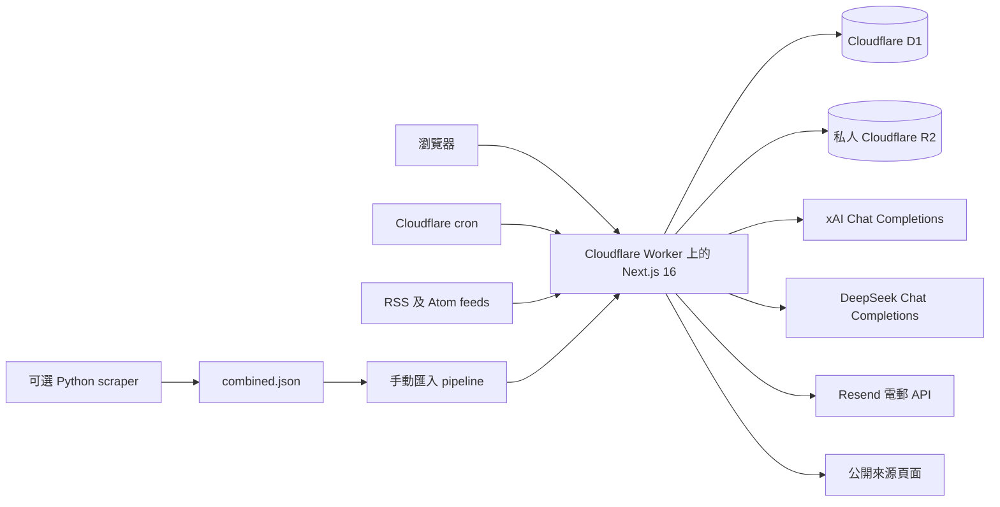
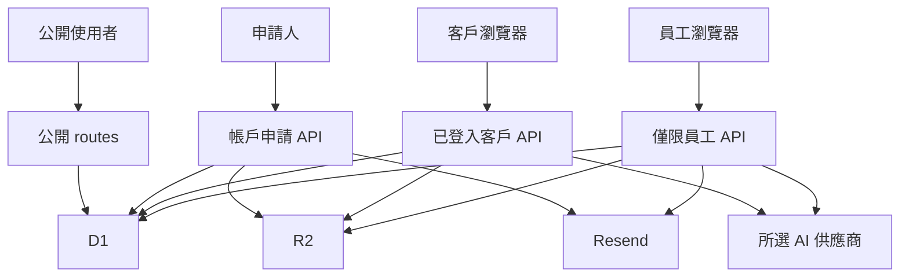

# PressReady 網站交接：擴充技術與營運參考

**編製日期：** 2026 年 8 月 19 日（香港時間）  
**系統：** PressReady／Cloudflare Worker `pressready-review`  
**正式網站：** <https://pressready-review.931smd-cloudflare-account.workers.dev>  
**主要本機版本：** `News-platform/`  
**GitHub 儲存庫：** <https://github.com/Hello000123/News-platform>  
**英文來源文件：** [PressReady website handover](WEBSITE_HANDOVER_DETAILED.md)  
**較短技術版本：** [PressReady website handover](WEBSITE_HANDOVER.md)  
**非技術版本：** [PressReady simple step-by-step guide](WEBSITE_HANDOVER_PLAIN_LANGUAGE.md)

本文件把原來已核實的交接文件擴充為長篇參考，供技術維護人員、營運人員、保安及資料負責人、編採員工、管理層和事故應變人員使用。內容描述系統在 2026 年 8 月 19 日的狀況；不代表此日期之後的供應商設定、資料數量、部署識別碼、帳單狀態或使用者權限仍然相同。

本文件不包含任何秘密值。為了營運和復原系統，文件保留環境變數名稱、服務 binding、帳戶識別資料、資料庫識別碼及公開網址。實際密碼、API 金鑰、一次性連結、session 識別碼、私人文件及資料庫匯出檔，只可存放於公司批准的系統。

## 文件目的及閱讀次序

本文件適用於：

- 員工離職及系統擁有權轉移。
- 新技術維護人員入職。
- 帳戶、新聞來源、發佈及 AI 功能的日常營運。
- 本機開發及測試。
- 正式環境發佈規劃及驗證。
- 事故初步判斷、回復舊版本及資料復原決策。
- 保安、私隱、備份、審計及供應商管理檢討。
- 在離職工程師的電腦或權限被更改前，保全目前本機原始程式碼。

建議閱讀次序：

1. 進行任何操作前，先閱讀「重要警告」及「首 24 小時工作」。
2. 在「擁有權、權限及升級處理」填寫真實負責人姓名。
3. 在接觸任何本機資料夾前，先閱讀「原始程式碼管理及保全」。
4. 操作帳戶、新聞來源、文章、部署、secret、資料庫或備份前，先閱讀相關工作流程。
5. 發生事故時，先使用相應事故處理程序，再參考部署、回復、資料庫或保安細節。
6. API 路由、migration、指令及術語可在附錄查閱。

## 證據及可信程度標示

本文件的陳述分為四類：

| 標示 | 意思 |
| --- | --- |
| 已核實儲存庫事實 | 直接取自目前主要本機版本、Git 狀態、設定、migration 或測試結果 |
| 已核實正式環境快照 | 於 2026 年 8 月 19 日從正式環境查詢，只在記錄時間有效 |
| 已記錄營運行為 | 有現有程式碼及測試支持，但日後更改後仍須在實際介面重新確認 |
| 公司必須作出的決定 | 無法從程式碼判斷，須由管理層、法律／私隱、財務或接任者提供 |

不要把有日期的快照當作永久事實。發佈、事故、migration、restore、保安變更或開支決策前，必須重新查詢正式環境。

## 管理摘要

PressReady 是 Next.js 16 及 React 19 應用程式，透過 OpenNext 部署到 Cloudflare Workers。系統結合公開新聞網站、需登入的 AI 審稿／改寫工作區、需登入的編採 pipeline，以及僅限員工的管理區。

Cloudflare D1 儲存帳戶、session、批核、電郵傳送 metadata、速率限制、AI 使用量、feed、pipeline 文章、改寫診斷、版面設定及客戶摘要。私人 Cloudflare R2 bucket 儲存帳戶申請附件及系統管理的文章／版面圖片。xAI 及 DeepSeek 提供兩個允許使用的 AI 模型；Resend 負責帳戶及停權通知電郵。

應用程式可運作，而目前 working tree 涉及的重點變更已通過相應測試。離職交接最嚴重的風險是原始程式碼保全：主要本機 `main` branch 比 GitHub 多 14 個 commit，並且有大量未 commit 工作。只依靠目前 GitHub 預設 branch，不能安全重建正式環境。

第二個重大風險是認證 secret 互相綁定。正式環境有 `AUTH_SECRET`，但沒有獨立設定 `PASSWORD_PEPPER`。程式碼會退回使用 `AUTH_SECRET` 作為 password pepper。若沒有 migration 或協調所有使用者重設密碼便輪換 `AUTH_SECRET`，現有 password proof 將全部失效。

第三個重大風險是發佈及復原成熟度。未發現儲存庫內有 CI/CD、自動 D1／R2 備份流程、與 commit 相連的部署 metadata、持久 Cloudflare observability 設定或已核實的自訂正式網域。發佈及重要復原工作目前依賴人工操作。

## 重要警告

### 1. 清理電腦或撤銷權限前，必須保全所有原始程式碼

不得在以下任何本機版本執行 `git reset`、`git clean`、具破壞性的 checkout 指令、force-push 或刪除資料夾：

- `News-platform/`
- `News-platform-latest/`
- `AI-Agent-News-Review-Rewrite/`

以 `News-platform/` 作為主要起點，但三個版本都有本機狀態，必須全部保留及比較。

### 2. 不得部署無法識別的 working tree

快照所記錄的正式 Worker version 沒有可信的 Git SHA、tag 或 deployment message。不得從另一個骯髒或尚未 push 的 working tree 部署，令追蹤問題惡化。日後每次部署必須記錄經審核的 commit SHA、branch、執行者、Worker version、deployment ID、migration 及 smoke test 結果。

### 3. 不得隨意輪換 `AUTH_SECRET`

目前 fallback 行為是：

```text
PASSWORD_PEPPER 已設定且最少 32 個字元
    -> 使用 PASSWORD_PEPPER
否則
    -> 使用 AUTH_SECRET
```

正式環境在快照時間沒有把 `PASSWORD_PEPPER` 列為獨立 secret。輪換 `AUTH_SECRET` 前，必須先把目前有效 pepper 保存成獨立管理的 `PASSWORD_PEPPER`，或協調所有帳戶重新設定密碼。此工作須經保安審核及具備已測試的 rollback 計劃。

### 4. 刪除客戶帳戶是永久操作

停權會保留帳戶及資料；刪除則會刪除客戶及相關伺服器資料。臨時或未確定情況應使用停權。刪除前須取得明確的業務及資料負責人批准。

### 5. 資料庫 restore 並非一般 rollback

回復舊 Worker 不會回復 D1 migration、D1 資料、R2 object、已發電郵或 AI 供應商請求。D1 restore 可能刪去選定還原時間後的合法寫入。執行前須確認目標時間、預計資料損失、現有備份、schema 相容性、授權及溝通計劃。

### 6. 外部服務測試可能收費或真正發送訊息

真實 AI 呼叫會消耗供應商額度；真實 Resend 測試會發出電郵；遠端 D1 操作及部署會改變正式環境。除非已批准帳戶、收件人、預算、時間及權限，否則不得以此作一般文件驗證。

### 7. `npm test` 目前不是可靠的一鍵 release gate

ESLint 會掃描 `.tmp/` 內由 Wrangler 產生的檔案，並可能出現 maximum-call-stack 錯誤。文件所列臨時 lint 指令會明確略過 `.tmp/**`。應修正 `eslint.config.mjs`，然後在 CI 重新建立有時間上限的完整測試套件。

## 交接首 24 小時

依次完成：

1. 暫停對三個本機版本的一切具破壞性清理。
2. 把本文件、原始交接文件及簡易版交接文件複製到公司批准的交接紀錄位置。
3. 指定產品、編採、技術、GitHub、Cloudflare、Resend、xAI、DeepSeek、財務、保安、私隱、備份及事故負責人。
4. 要求接任者使用自己的公司帳戶登入，並記錄他們可存取的實際 project／workspace。
5. 從 `News-platform/` 建立經審核的安全 branch，保全 14 個本機 commit，檢查未 commit 變更有沒有 secret，並透過 pull request push。
6. 封存或刪除其他兩個本機版本前，先盤點其獨有變更。
7. 記錄哪個經審核 commit 最接近現時正式 Worker version。
8. 匯出 D1 到公司批准的加密儲存，並記錄保留政策；不得放入 Git。
9. 確認 R2 備份／保留要求及負責人。
10. 撤銷或輪換任何認證 secret 前，決定 `PASSWORD_PEPPER` migration 或重設密碼方案。
11. 確認 Resend sender／domain 計劃；快照所記錄的是測試 sender。
12. 使用接任者帳戶完成公開及已登入 smoke check。
13. 只有在接任者權限及復原途徑獨立確認後，才撤銷離職工程師的個人權限。

## 擁有權、權限及升級處理

### 擁有權登記表

離職前完成所有 `待定` 項目。不要填寫憑證。

| 範疇 | 最終負責人 | 日常操作負責人 | 後備負責人 | 已測試權限 | 證據／內部紀錄 |
| --- | --- | --- | --- | --- | --- |
| 產品範圍及推出決策 | **待定** | **待定** | **待定** | [ ] | **待定** |
| 編採標準、發佈及更正 | **待定** | **待定** | **待定** | [ ] | **待定** |
| 應用程式維護 | **待定** | **待定** | **待定** | [ ] | **待定** |
| GitHub organization 及 repository | **待定** | **待定** | **待定** | [ ] | **待定** |
| Cloudflare 帳戶及帳單 | **待定** | **待定** | **待定** | [ ] | **待定** |
| D1 資料庫及復原 | **待定** | **待定** | **待定** | [ ] | **待定** |
| R2 私人檔案及保留 | **待定** | **待定** | **待定** | [ ] | **待定** |
| Resend 帳戶、domain 及帳單 | **待定** | **待定** | **待定** | [ ] | **待定** |
| xAI 帳戶、key、限制及帳單 | **待定** | **待定** | **待定** | [ ] | **待定** |
| DeepSeek 帳戶、key、限制及帳單 | **待定** | **待定** | **待定** | [ ] | **待定** |
| 密碼管理器及復原程序 | **待定** | **待定** | **待定** | [ ] | **待定** |
| 保安事故處理 | **待定** | **待定** | **待定** | [ ] | **待定** |
| 私隱／資料當事人要求 | **待定** | **待定** | **待定** | [ ] | **待定** |
| 備份驗證及 restore 測試 | **待定** | **待定** | **待定** | [ ] | **待定** |
| 非辦公時間升級處理 | **待定** | **待定** | **待定** | [ ] | **待定** |

### 權限轉移驗收測試

每個外部服務均須：

1. 接任者在自己的裝置使用自己的公司身份登入。
2. 確認正確 organization、account、team 及 project。
3. 確認具備最低所需角色。
4. 如服務支援，由第二位公司管理員確認復原權限。
5. 把帳單及保安通知轉到受監察的公司電郵地址。
6. 只有在公司復原途徑運作後，才移除個人復原電郵及離職員工裝置。
7. 記錄結果、日期、執行者及內部證據連結。

Wrangler 在快照時間使用 `info@931smd.com` 認證。這只是有日期的觀察，不代表已建立持久共享擁有權。

### 升級處理紀錄

| 嚴重程度 | 例子 | 初步回應目標 | 決策人 | 技術負責人 | 溝通渠道 |
| --- | --- | --- | --- | --- | --- |
| Critical | 網站全面中斷、懷疑入侵、具破壞性的資料事故 | **待定** | **待定** | **待定** | **待定** |
| High | 登入全面中斷、大範圍發佈失敗、AI 開支失控 | **待定** | **待定** | **待定** | **待定** |
| Medium | 單一供應商中斷、feed 積壓、電郵傳送失敗 | **待定** | **待定** | **待定** | **待定** |
| Low | 外觀問題、單一 feed 暫停、文件修正 | **待定** | **待定** | **待定** | **待定** |

## 產品範圍及使用者流程

### 公開新聞網站

公開訪客可使用：

- `/` — 首頁。
- `/technology` — 科技分類頁。
- `/social-enterprise` — 社企分類頁。
- `/news` — 新聞索引。
- `/news/[id]` — 已發佈文章。
- `/request-account` — 申請帳戶。
- `/request-submitted` — 申請提交確認。
- `/login` — 登入入口。
- `/setup-password` 及 `/invalid-setup-link` — 已批准帳戶設定密碼流程。

只有 approved／live 狀態文章應出現在公開新聞網站。Presentation 記錄可更改文字樣式及圖片位置／尺寸，但不會解鎖固定頁面結構。

### AI 審稿及改寫工作區

已登入客戶及員工在 `/review`：

1. 提交草稿文字、公開 source URL 或支援檔案的文字。
2. 選擇 Grok 4.5 或 DeepSeek V4 Pro。
3. 要求一次結構化寫作審閱。
4. 閱讀分數、ready 狀態、問題、優點、缺漏資料及建議。
5. 明確要求改寫；審閱不會自動啟動改寫。
6. 以精簡／較詳細偏好及可選指示再作修訂。

瀏覽器把目前來源及成功改寫回合保存在該分頁的 session storage；這不是帳戶層級文章歷史系統。

### 編採 pipeline

已登入客戶及員工在 `/pipeline`：

- 瀏覽 feed 及 scraper 匯入內容。
- 按 new、rewritten、approved、discarded 或全部篩選。
- 讀取或檢查已保存完整來源文字。
- 按獨立來源把熱門報道分組。
- 使用相關報道作證據生成 AI 改寫。
- 編輯標題、內文、分類及主圖。
- 儲存草稿、發佈、更新、下架或放棄。
- 失敗後查看已清理敏感內容的 rewrite diagnostics。

員工另可控制公開版面編輯。即使 AI 產生草稿，發佈仍由人員決定。

### 員工管理

員工使用 `/employee` 及相關詳情頁。目前分頁包括：

- **Account Approval** — pending、approved、rejected 及所有申請。
- **Client Accounts** — 帳戶、AI 使用量、停權、復權及刪除。
- **Client Overview** — company type 匯總分佈。
- **Employee Accounts** — 員工帳戶檢視。
- **News Feeds** — feed 增刪改查、手動 fetch、暫停／恢復及排程。

客戶詳情頁可顯示已發佈文章及 AI 生成公司摘要。公司摘要最多使用 50 篇已發佈文章，每篇最多 1,500 個字元證據；不得把它當作已核實公司背景資料。

## 角色及授權矩陣

| 功能 | 公開 | 客戶 | 員工 |
| --- | ---: | ---: | ---: |
| 閱讀已批准公開頁面 | 是 | 是 | 是 |
| 提交帳戶申請 | 是 | 是 | 是 |
| 登入及登出 | 可開頁面但須有效帳戶建立 session | 是 | 是 |
| 審閱及改寫草稿 | 否 | 是 | 是 |
| 擷取支援檔案文字 | 否 | 是 | 是 |
| 查看及編輯 pipeline | 否 | 是 | 是 |
| 發佈或下架 pipeline 文章 | 否 | 是 | 是 |
| 編輯文章／公開頁 presentation | 否 | 否 | 是 |
| 查看帳戶申請附件 | 否 | 否 | 是 |
| 批准／拒絕／重發設定連結 | 否 | 否 | 是 |
| 查看所有客戶及員工帳戶 | 否 | 否 | 是 |
| 停權／復權／刪除客戶 | 否 | 否 | 是 |
| 設定 AI 使用量停權規則 | 否 | 否 | 是 |
| 管理 feed 及排程 | 否 | 否 | 是 |
| 生成／查看客戶公司摘要 | 否 | 否 | 是 |

Server route 會執行角色檢查；瀏覽器隱藏按鈕並不是授權邊界。需要登入的變更 API 亦有 same-origin 及 CSRF 保護。

## 系統架構



### 請求及資料邊界



### 技術清單

| 層面 | 技術 | 現時用途 |
| --- | --- | --- |
| Web framework | Next.js 16 App Router | 頁面、route handler、rendering、headers |
| UI runtime | React 19 | 瀏覽器互動及 server-rendered UI |
| 程式語言 | TypeScript 5.9（strict） | 應用程式及測試 |
| Edge packaging | `@opennextjs/cloudflare` 1.20.2 | 把 Next.js build 成 Cloudflare Worker |
| Hosting/runtime | Cloudflare Workers | Fetch handler、assets、scheduled handler |
| 資料庫 | Cloudflare D1 | 關聯式應用資料 |
| Object storage | Cloudflare R2 | 私人文件及系統管理圖片 |
| Validation | Zod 4.4 | 請求、供應商回應及共用 contract |
| 壓縮／archive | `fflate` | 安全擷取 Office archive |
| PDF extraction | `unpdf` | 有限制的 PDF 文字擷取 |
| 密碼 derivation | 瀏覽器 `scrypt-js`；相容 server crypto | Client proof 及 server 驗證 |
| AI 供應商 | xAI 及 DeepSeek Chat Completions | 審閱、改寫、圖片分析、客戶摘要 |
| 電郵 | Resend-compatible HTTP API | 帳戶及客戶生命週期電郵 |
| 測試 | Vitest 4.1、Testing Library、Miniflare | Contract、route、UI、D1／Worker 行為 |
| Scraper | Python 3.12、requests、Beautiful Soup、feedparser、boto3 | 可選外部文章收集 |
| Container 排程 | Docker 加 cron | 可選每 30 分鐘 scraper job |

### Cloudflare runtime 設定

- Worker 名稱：`pressready-review`。
- Entry point：`worker.ts`。
- Compatibility date：`2026-07-28`。
- Compatibility flags：`nodejs_compat`、`global_fetch_strictly_public`。
- Static asset binding：`ASSETS`，來源 `.open-next/assets`。
- D1 binding：`DB`。
- R2 binding：`ACCOUNT_DOCUMENTS`。
- Cron expression：`0 0 * * *`。
- CPU 上限：30,000 ms。
- Subrequest 上限：1,000。
- Minification：已啟用。
- Observability：儲存庫設定為停用。

自訂 scheduled handler 會先檢查 `feed_schedule_settings`。若該 row 不存在、停用或尚未到期，會寫入 skip log 並結束；到期時會擷取所有 active feed、更新 `last_auto_fetch_at`，並記錄 parsed、added 及 failed 數量。錯誤會由 handler 捕捉並寫入 Worker log，不會向外拋出 scheduled handler。

## 儲存庫及程式碼地圖

| 路徑 | 責任 |
| --- | --- |
| `app/` | App Router 頁面及 HTTP route handlers |
| `components/` | 認證、審稿、pipeline、員工及公開新聞 UI |
| `lib/client/` | 瀏覽器 API client、password proof、檔案、改寫語言及 session 邏輯 |
| `lib/server/agents/` | 供應商 client、prompt、審閱／改寫 agent、model routing、引文驗證 |
| `lib/server/auth/` | 設定、資料庫、帳戶生命週期、session、rate limit、使用量、電郵 |
| `lib/server/feeds/` | Feed parsing、擷取、repository、熱門分組、pipeline、diagnostics |
| `lib/server/sources/` | URL／DNS／redirect 檢查、有界擷取及來源抽取 |
| `lib/server/uploads/` | 檔案驗證／抽取、圖片分析、儲存、新聞圖片 |
| `lib/shared/` | Zod contract、共用 types、models、分類及 presentation schema |
| `migrations/` | D1 migration `0001` 至 `0021` |
| `tests/` | Unit、component、route、Miniflare integration、calibration、live evaluation |
| `execution/` | Python scraper 及來源設定 |
| `directives/` | Scraper SOP 及來源特定知識 |
| `scripts/` | 互動式本機／遠端員工帳戶建立 |
| `docs/` | 認證、交接、設計研究及測試文件 |
| `worker.ts` | OpenNext fetch handler 及 Cloudflare scheduled ingestion |
| `wrangler.jsonc` | Worker、D1、R2、variables、limits、assets、cron |

主要頁面包括公開 `/`、`/technology`、`/social-enterprise`、`/news/[id]`；認證 `/login`、`/request-account`、`/setup-password`；工作區 `/review`、`/pipeline`；員工 `/employee`、`/employee/requests/[id]`、`/employee/clients/[id]`。

### 重要限制

| 項目 | 上限 |
| --- | ---: |
| 草稿／來源／改寫文字 | 50,000 字元 |
| 一般 review／rewrite request body | 220,000 bytes |
| Source／feed URL | 2,048 字元 |
| Image context | 8 項 |
| Rewrite instruction | 4,000 字元 |
| Rewrite history | 24 項 |
| Feed 名稱 | 120 字元 |
| Pipeline 標題／描述／作者 | 1,000／20,000／500 字元 |
| Related article IDs | 200 |
| Rewrite debug 查詢 | 最多 100 rows |
| Upload | 50 個檔案、合共 10 MiB |
| PDF | 250 頁 |
| Office archive | 5,000 entries、展開合共 50 MiB、單項 16 MiB |
| Extraction timeout | 30 秒 |

## 原始程式碼管理及保全

2026 年 8 月 19 日已核實：主要本機版本為 `News-platform/`、branch `main`；local HEAD `2c5dfdd59642a62e78a34efc358fb450b94eafe6`；`origin/main` 為 `f2a0f5786c5a6778731e336035e7225c67b45696`；本機多 14 commits、沒有落後；`feature/replace-picture` 指向相同 local HEAD；未發現 release tag；remote 為 `https://github.com/Hello000123/News-platform.git`。

加入交接文件前有 17 個 modified tracked files、一個 untracked test，約 473 additions／42 deletions，涉及首頁及分類、scraper 指令、AI prompt／rewrite、熱門分組、public presentation、DNS source context、Cloudflare 設定及測試。Untracked application test 是 `tests/source-context-default-dns.test.ts`。

另有 `News-platform-latest/` 及 `AI-Agent-News-Review-Rewrite/` 兩個有未保存工作、歷史及 remote 差異的本機版本。比較前不得刪除或部署。

先執行只讀檢查：

```bash
git status --short --branch
git remote -v
git branch -vv
git log --oneline --decorate --graph --all
git diff --stat
git diff --check
git diff
```

逐檔檢查 secret／產生檔／私人資料後才保全：

```bash
git switch -c handover/wip-2026-08-19
git add <explicit-reviewed-file-1> <explicit-reviewed-file-2>
git diff --cached --check
git diff --cached
git commit -m "chore: preserve website handover state"
git push -u origin handover/wip-2026-08-19
```

建立 pull request，記錄 branch、SHA、reviewer、刻意排除檔案、secret review、與正式 Worker 的關係及未完成測試／文件／部署安全問題。確認 `.dev.vars`、`.tmp`、匯出檔及 generated output 已忽略前，不得 `git add .`；不得 force-push `origin/main`。

未發現 `.github` CI/CD；`.env*`（example 除外）及 `.dev.vars` 已 gitignore；`.tmp/` 被 Git 忽略但未被 ESLint 忽略；`.next/`、`.open-next/`、cache、coverage、Wrangler state 均屬 generated output。

## 正式環境清單及有日期快照

快照：約 2026 年 8 月 19 日 21:40 HKT。

| 項目 | 當時已核實值 |
| --- | --- |
| URL | `https://pressready-review.931smd-cloudflare-account.workers.dev` |
| Homepage | HTTP 200；有 no-store／private 及 security headers |
| Worker／Cloudflare account | `pressready-review`／`931SMD Cloudflare Account` |
| Account ID | `d795f2f2ac58af5e123b27097f1f9766` |
| Active Worker version | `7de4644a-91b6-40cd-9168-f37a593f5d28`（100%） |
| Deployment | `99542e2e-e8fa-433f-98e7-1316f422e178` |
| 時間／執行者 | 19 Aug 2026 21:32:32 HKT／`info@931smd.com` |
| 上一版本 | `f11dc00a-2621-43bd-8366-59e0ea3d444e` |
| D1 | binding `DB`、name `pressready-auth`、ID `b4865986-9ed1-430a-945a-2675ca22a2ed` |
| Migration | `0001`–`0021` 全部已套用 |
| R2 | `ACCOUNT_DOCUMENTS`／`pressready-account-documents` |
| Cron／feed schedule | `0 0 * * *`（08:00 HKT）；enabled、1,440 分鐘 |
| 最後 scheduled fetch | 19 Aug 2026 08:00:14 HKT |
| Wrangler | 4.114.0 |

當時非個人資料數量：17 active feeds；1,682 new、13 rewritten、1 approved/live pipeline articles；2 active employees、1 disabled employee、1 setup-pending client、1 approved account request。這些只供方向參考，不是正常門檻。

正式部署 metadata 沒有可靠 Git SHA、tag 或有用 message。上一 version ID 不等於安全 rollback 目標，必須先檢查 D1 schema 相容性。

## 設定及環境變數

本機 Next.js 通常使用 `.env.local`，OpenNext／Workerd preview 使用 `.dev.vars`，正式非 secret vars 在 `wrangler.jsonc`，秘密值在 Cloudflare secret store。不得把秘密變數改成 `NEXT_PUBLIC_`。

### AI

`XAI_API_KEY`、`DEEPSEEK_API_KEY` 是 server secret；`AI_MODEL` 預設 `grok-4.5`；`REVIEW_PASS_SCORE` 預設 80（0–100）；xAI／DeepSeek base URL 預設 `https://api.x.ai/v1`、`https://api.deepseek.com`；timeout 預設 600,000 ms（1,000–600,000）；stream 預設 `true`。只接受 `grok-4.5`、`deepseek-v4-pro`。兩者使用 high reasoning，不公開 reasoning trace。

### 認證及電郵

| Variable | 用途／預設 |
| --- | --- |
| `APP_ENV` | `development`／`test`／`production` |
| `PUBLIC_APP_URL` | 正式 email link origin；production 必須 HTTPS |
| `AUTH_SECRET` | Production secret；HMAC 及相容 pepper fallback |
| `PASSWORD_PEPPER` | 穩定 password proof 保護；缺少時 fallback 到 `AUTH_SECRET` |
| `SESSION_TTL_SECONDS` | 預設 43,200；限制 900–604,800 |
| `PASSWORD_SETUP_TTL_SECONDS` | 預設 86,400；限制 3,600–604,800 |
| `ACCOUNT_APPROVAL_NOTIFICATION_EMAIL` | 新申請通知收件人 |
| `EMAIL_FROM_ADDRESS`／`EMAIL_FROM_NAME` | Sender；名稱預設 `PressReady` |
| `EMAIL_DELIVERY_MODE` | Local 可 `preview`；production 必須 `http` |
| `EMAIL_PROVIDER_API_URL`／`EMAIL_PROVIDER_API_KEY` | Resend endpoint 及 secret |
| `EMAIL_PROVIDER_AUTH_HEADER`／`SCHEME` | 預設 `Authorization`／`Bearer` |
| `AUTH_D1_DATABASE_NAME` | 員工建立 script 的 D1 name override |

Production 會拒絕非 HTTPS provider URL、含 embedded credentials 的 URL，以及 preview email mode。Scraper 可選 vars 是 `R2_ACCESS_KEY_ID`、`R2_SECRET_ACCESS_KEY`、`R2_ENDPOINT`、`R2_BUCKET`、`MAX_ITEMS_PER_SOURCE`、`REQUEST_DELAY`；與 Worker R2 binding 分開。

快照所記錄 non-secret vars 包括 production app URL、session／setup TTL、通知地址 `jimmy.zhang@931smd.com`、sender `931SMD-Testing <onboarding@resend.dev>`、Resend endpoint 及 `AI_MODEL=grok-4.5`。此 sender 只適合限制測試，應改用公司已驗證 domain。

Secret list 只有 `AUTH_SECRET`、`DEEPSEEK_API_KEY`、`EMAIL_PROVIDER_API_KEY`、`XAI_API_KEY`；沒有 `PASSWORD_PEPPER`，而且沒有讀取任何值。

## Secret 擁有權及輪換

在 Git 以外維護 secret register，為 `AUTH_SECRET`、`PASSWORD_PEPPER`、`XAI_API_KEY`、`DEEPSEEK_API_KEY`、`EMAIL_PROVIDER_API_KEY` 及任何 scraper R2 credentials 記錄主要／後備 owner、password-manager record、上次輪換、下次 review 及是否測試輪換後果。不得在此表填寫 actual value。

輪換 secret 前須盤點 consumer／environment、確認接任者及 break-glass access、備份並記錄 deploy、先處理 pepper、建立 least-privilege 新 key、更新 password manager 及 runtime、smoke test、確認後才撤銷舊 key，並記錄執行者／時間／結果／rollback。

## D1 資料庫及 migration 歷史

D1 `pressready-auth` 不只儲存認證，亦是 account request、user、session、audit、附件 metadata、AI usage、threshold、feed、pipeline、source、publication、rewrite diagnostics、presentation 及 client summary 的主資料庫。

| Migration | 目的 |
| --- | --- |
| `0001`–`0005` | Authentication、optional request fields、client removal、attachments、AI usage |
| `0006`–`0011` | Feed/pipeline、source content、merge、schedule、publication、category |
| `0012`–`0015` | Rewrite debug、rewrite commits、article presentation、多附件 |
| `0016`–`0018` | Timestamped usage、configurable suspension、client summaries |
| `0019`–`0021` | Public-page presentation、suspension duration、manual suspension/recovery |

`account_requests` 儲存申請及決定；partial unique index 防止同一 email 同時多個 pending request。`users` 儲存角色、狀態、profile、password、來源 request 及 suspension。Setup token、session token、CSRF token 只把 hash 放入 D1。`login_rate_limits` 使用 HMAC bucket key。`feeds` 及 `pipeline_articles` 儲存來源和出版狀態；rewrite commit／debug 分開保存；article/public-page presentation 分開 draft 及 published JSON。

不得修改已套用 migration；新增 ordered migration。本機先測試，破壞性改動前匯出遠端 D1，評估新舊 Worker/schema 相容性，批准時段套用並記錄檔名、結果、執行者、備份、commit 及 Worker version。

```bash
npm run db:migrate:local
npx wrangler d1 migrations list pressready-auth --local
npx wrangler d1 migrations list pressready-auth --remote
npm run db:migrate:remote
```

公司須另訂 account request、attachment、disabled account、audit、session/token、usage、debug、文章、presentation、D1 export 及 R2 orphan 的保留／刪除政策；不可只依賴 cascade behavior 推斷法律要求。

## 認證及帳戶生命週期

角色為 `client`／`employee`；user 狀態為 `setup_pending`／`active`／`disabled`；request 狀態為 `pending`／`approved`／`rejected`。

公開申請會驗證資料及最多 50 個、合共 10 MiB 的 PDF、DOCX、PPTX、XLSX、PNG、JPEG、WebP；metadata 入 D1、bytes 私下入 R2，並嘗試寄通知。員工批核會建立 setup-pending client、hashed one-time token、audit 及電郵；拒絕會記錄原因。Setup link 預設 24 小時、一次使用，raw token 不入 D1。

密碼接受 9–63 個 printable English keyboard characters，沒有必須大小寫／數字／符號組合。Scrypt 參數：cost 32,768、block size 8、parallelization 3、salt 16 bytes、proof 32 bytes。瀏覽器 derive proof，server 使用 pepper 保護。亦有限度支援 legacy PBKDF2 proof。

登入 rate limit：email+IP 在 15 分鐘最多 5 次失敗；IP 全體最多 20 次；達標封鎖 15 分鐘。成功登入只清除 email/IP bucket，不清 IP-wide bucket。24 小時以前 rate-limit row 會在記錄失敗時清理。

Session cookie `pressready_session`（HTTP-only、SameSite Lax）；CSRF cookie `pressready_csrf`（SameSite Strict），production 均 Secure。預設 session 12 小時，限制 15 分鐘至 7 日。變更 API 以 `x-csrf-token` header、cookie 及 D1 hash 比較。Logout、suspend、remove 會 revoke session。

Manual suspension 保留資料並撤銷 session；recovery 可清除 manual／active automatic suspension，沿用原密碼。AI usage 可設 15 分鐘、1／6／12／24 小時五個 rolling rules；threshold 最多 1,000,000，停權 0.01–8,760 小時。預設各 rule disabled、threshold 100、停權 6 小時。最短被觸發 period 優先；停權中請求不再計數／延長；employee exempt。

使用量報告另有 7／30／90／180／365 日、香港 month-to-date、year-to-date、lifetime。事件追蹤開始前的歷史 window 可能不完整。

永久 remove 要輸入 admin message 及客戶精確名稱；會刪除 user、request、email、session、token、usage、suspension、summary、client publishing data、私人附件及未共享 managed images，刪除後才嘗試通知。Employee removal 不在 UI 提供。

## 電郵及 Resend

Message type：`new_request`、`approved_setup`、`rejected`、`client_removed`、`client_suspended`。HTTP request 包含 from、to、subject、text、HTML、`message_type` tag，timeout 10 秒。Redirect 手動處理，避免 auth header 被轉發；failure log 只記錄有界診斷，不記 key 或 provider body。

Local preview 只記 metadata，setup URL 只在受保護員工頁顯示，不真正寄信或在 terminal 列印 token。正式環境禁止 preview。正式使用前須驗證公司 domain、設定 SPF／DKIM／DMARC、更新 sender、確認 billing owner、測試 delivery／bounce／complaint／suppression 及記錄 resend 流程。

## AI 供應商及編採流程

允許 `deepseek-v4-pro`（DeepSeek V4 Pro）及 `grok-4.5`（Grok 4.5，預設）。Timeout 預設 600 秒；stream 預設開啟；最多兩次 transport attempts、retry delay 500 ms，只重試已分類 transient network／rate-limit／unavailable／malformed／empty／capacity failure。Public diagnostics 不包含 raw provider body。

Review 是寫作質素評估，不是外部 fact check。Server 建立 immutable source snapshot；同時有 draft 及 URL 時只評 draft，linked source 留給改寫；URL-only 則 extracted article 成為 primary copy。AI 回 strict JSON，server 自行重算 weighted score、cap、readiness、decision，且不自動改寫。

分數權重：完整性／內部一致性 25%、結構 20%、清晰 15%、語言 15%、專業 15%、引述 10%。Readiness：90+ `PUBLICATION_READY`、75+ `STRONG_LIMITED_EDITING`、60+ `SUBSTANTIAL_REWRITE`、40+ `WEAK`、其餘 `SEVERELY_DEFICIENT`。Pass label 預設 80。

Rewrite 使用 source snapshot、review、history、refinement、length、language、model。面向使用者預設香港繁體中文；人名、直接引語、數字、產品／型號及 source-script terms 必須忠實。Validation 包括格式、echo、headline、數字、quotation、speaker attribution、可安全 deterministic repair 及有限 correction attempts；結果只可 `passed`／`passed_after_retry`，1–3 attempts。AI 成功不等於可發佈，必須人工核實。

Pipeline related evidence 最多 200 article IDs、總 supporting text 50,000 字元、每份 12,000。Debug 只存 stage、provider、model、status、retryable、cause、validation、debug ID 等有界 metadata，不存 source/output、credential、stack trace，保留約 30 日。

## 公開來源擷取及 SSRF 保護

只接受無 embedded credentials 的公開 HTTP／HTTPS URL；檢查 hostname、IPv4／IPv6、private／loopback／link-local／reserved address；任一 address family 有私人地址即拒絕；redirect 逐個手動重新驗證；限制 body、字元、timeout、content type 及 charset。仍有 DNS rebinding TOCTOU 限制；若要抵禦高階對手，應使用 resolver-pinning egress proxy。事故只記錄安全 hostname、public addresses、redirect、status/type、stage 及 error code，不記 cookie、credential 或完整私人內容。

## Feed ingestion 及可選 scraper

員工在 **Admin Panel → News Feeds** 新增／編輯 feed、fetch 一個或全部、pause／resume、remove、設定自動排程。Remove 會刪除相關 pipeline data；臨時處理應 pause。Cloudflare cron 每日 00:00 UTC／08:00 HKT 觸發，D1 schedule 再判斷是否到期；快照為 enabled、1,440 分鐘。

Feed 停滯時：檢查 schedule、last auto-fetch、各 feed status/error；只作一次 controlled fetch；分辨單一來源或全系統；受 challenge 或持續失敗來源先 pause；不得繞過 publisher 防護；核實修正後更新 `directives/scrape_news.md`。

Python scraper 把結果寫到 `.tmp/YYYY-MM-DD/combined.json`，再由已登入使用者匯入 pipeline：

```bash
python3 -m venv .venv
source .venv/bin/activate
pip install -r requirements.txt
python -m unittest discover -s execution/tests -v
npm run scrape:news
```

Docker 使用 Python 3.12 slim＋cron，啟動先 scrape 一次再前景執行 cron；Compose 以 read-only 掛載 `execution/`、named volume、香港時區、restart unless stopped、三個 10 MiB rotating logs。它與 Worker feed schedule 是兩套系統；未發現 Docker scraper 正在正式環境託管。HKEPC／TechRitual 受 Cloudflare challenge，on.cc body 為 JS-only，Ars Technica article page 為 HTTP 202 challenge／feed-only。瀏覽器可開首頁不代表 scraper path 可用。

## 編採 pipeline 及發佈生命週期

狀態為 `new`、`rewritten`、`approved`、`discarded`；合併子文章不出現在公開 listing。Feed／JSON import 會 normalize、deduplicate，source text 最多 50,000 字元，不會自動公開。

工作流程：選文章；檢查 title/source/author/time/full body；RSS preview 必須視為不完整；選 model／language／length／instruction；生成可編輯 rewrite；檢查 diagnostics；編輯 public headline/body/category/image；**Save changes** 供審核，人工批准後才 **Publish to homepage**。其他實際按鈕包括 **Rewrite draft**、**Rewrite again**、**Rewrite & publish**、**Update homepage**、**View live post**、**Unpublish**、**Discard**。有人工預審要求時避免直接 **Rewrite & publish**。

發佈前核對完整來源、標題、人名／機構、日期／時間／數字／貨幣／單位／型號／排名、引語及說話者、AI unsupported claims、語言轉換、分類、圖片權利／credit、私隱及第二人批准；發佈後檢查 desktop/mobile 並記錄。更正時保存 URL／截圖／時間，必要時先下架，以證據修正、批准後重發並記錄原因及決策人。

## 公開 presentation 編輯

只限 employee。Draft JSON 私人保存，**Publish** 才更新 public；block／page topology 為 allowlist 及鎖定；可直接改文字、字體／大小／格式／顏色及所選圖片尺寸；有 undo/redo 及 unsaved warning。**Save** 不公開，**Discard** 放棄 draft。來源事實修正在 pipeline，純版面變更才用 presentation editor。

## Upload、文字擷取及 R2

支援 PDF、DOCX、PPTX、XLSX、PNG、JPEG/JPG、WebP；最多 50 個、合共 10 MiB。會 normalize filename、檢查 extension＋MIME＋signature；拒絕 encrypted/password PDF、損壞圖片、Office path traversal、encrypted entries、macro、zip bomb；PDF 最多 250 頁、Office entries 5,000、展開 50 MiB／單項 16 MiB、timeout 30 秒，抽取文字最多 50,000 字元。

R2 binding `ACCOUNT_DOCUMENTS` 必須保持私人；附件及 managed images 使用不同 namespace，由 application route 授權存取。不得為私人附件開 public R2 URL/domain。應制定 lifecycle、orphan cleanup、encryption、backup、access log。News image 只接受 PNG/JPEG/WebP 10 MiB；切回 public image URL 前要移除 uploaded image。

## 員工報告及客戶摘要

Usage 報告按 rolling、香港月／年至今及 lifetime 匯總；timestamp tracking 之前的期間可能標示 partial。Client company summary 最多使用最近 50 篇合資格文章、每篇 1,500 字元；結果有 company name/type、最多 12 products/services、description、最多 12 recurring subjects、insufficient-information、來源數量、model、時間及執行員工。重新生成會覆寫現時 summary；不可用作法律、信貸、招聘或 compliance 決策。Overview case-insensitive 分組 company type，把空白／placeholder 歸入 **Unknown / Unclassified**，所有 client 狀態都在 denominator。

## 本機開發

需要 Node.js 22.13+、npm；scraper 才需要 Python 3.12／Docker；Miniflare/OpenNext 需要 loopback 權限。

```bash
cd "/path/to/news platform (real)/News-platform"
npm ci
cp .env.example .env.local
cp .dev.vars.example .dev.vars
npm run db:migrate:local
npm run dev
```

開 <http://localhost:3000>。本機 email 使用 `APP_ENV=development`＋`EMAIL_DELIVERY_MODE=preview`。建立本機員工：`npm run create-employee:local`；遠端 `npm run create-employee:remote` 會改正式資料，只可經批准使用。Preview：`npm run preview`，通常 <http://localhost:8787>。

常見問題：`listen EPERM 127.0.0.1` 是 restricted loopback；auth unavailable 檢查 secret／mode；email config 檢查 production preview／provider；AI auth 檢查 server key/model permission；source rejected 不得繞過 SSRF。

## 測試及品質

```bash
npm run typecheck
npx eslint . --ignore-pattern '.tmp/**'
npm run test:unit
npm run build
npm run preview
python -m unittest discover -s execution/tests -v
```

測試涵蓋 contract、provider、workflow、prompt、quotation、source/DNS、auth、migration、upload、usage、feed、pipeline、public rendering、presentation、client summary/overview。2026-08-19 已通過 typecheck、臨時 lint、build、8 個 focused files 共 136 tests、auth integration 13 tests；Miniflare tests 在允許 loopback 時通過。不得聲稱 `npm test`、完整 Vitest suite 或 Python scraper tests 已完整通過：`.tmp/` lint 問題、full suite 長時間無輸出、缺 venv／Beautiful Soup 尚待處理。Live evaluation 會收費，只可經批准執行。

## 正式部署程序

只可從 clean、reviewed、pushed commit 部署；記錄 ticket、owner、reviewer、branch、SHA、PR、migration、D1 export/checksum、R2／external impact、test、rollback candidate、window 及 communication。

```bash
git status --short --branch
git rev-parse HEAD
npm ci
npx wrangler d1 migrations list pressready-auth --remote
mkdir -p .tmp/backups
npx wrangler d1 export pressready-auth --remote --output .tmp/backups/pressready-auth-YYYY-MM-DDTHHMM.sql
npm run typecheck
npx eslint . --ignore-pattern '.tmp/**'
npx vitest run --reporter=verbose
npm run build
npm run db:migrate:remote
npx wrangler d1 migrations list pressready-auth --remote
npm run deploy
npx wrangler deployments status --json
npx wrangler secret list
```

D1 export 屬敏感資料，須 checksum、移到批准加密位置、驗證可讀、不得 commit。Migration ambiguous result 時先查狀態，不要盲目重跑。部署後檢查首頁、分類、文章、login、request、employee、pipeline、client authorization、logout、feed；真實 AI/email/publication 只用批准測試。最後記錄 version、deployment ID、migration、backup、smoke result、deviation、monitor owner。

## Rollback 及資料復原

```bash
npx wrangler deployments list
npx wrangler rollback <known-good-version-id> --message "Rollback: <incident-id and reason>"
```

歷史上一版本 `f11dc00a-2621-43bd-8366-59e0ea3d444e` 只供參考。Rollback 前確認事故、決策人、current version、migration/data write、candidate schema 相容、保存 logs、溝通；執行一次 controlled rollback 後 smoke test。Worker rollback 不回復 D1／R2／email／AI。

小而明確問題優先 reviewed SQL repair；大範圍才考慮 restore：

```bash
npx wrangler d1 time-travel info pressready-auth
npx wrangler d1 time-travel restore pressready-auth
```

Restore 前確認 retention、精確時間／時區、之後所有寫入、fresh export、schema、data-owner approval、reconciliation、暫停 concurrent writes；之後驗證 migration、auth、feed、publication、presentation、R2 reference，記錄資料損失。未發現自動 R2 backup；須定義 versioning、加密 destination、inventory/checksum、retention、restore test、orphan cleanup 及 D1 coordination。

## 日常營運時間表

每日：檢查首頁／分類／文章、pending requests、緊急更正、pipeline freshness、feed errors、email／provider alerts，記錄事故及 destructive decisions。每週：檢查 client suspension／usage、AI spend／rate limit、Resend delivery、backup record、feed failure、deployment traceability、owner availability。每月：review privileged access、兩位 Cloudflare admins、secret recovery、restore test、D1/R2 retention、AI thresholds、CI evidence、聯絡人及交接文件。每季或重大變更後：在非正式環境演練 Worker rollback、D1 recovery、SSRF／egress、upload parser、auth／pepper、provider model／price／permission、資料保留及事故角色。

## Monitoring、logs 及 diagnostics

`wrangler.jsonc` 的 observability 為 disabled，未有 repository-defined persistent log／metric／alert pipeline。即時查看：

```bash
npx wrangler tail pressready-review --format pretty
```

最低應監察 Worker volume/status/latency/CPU/subrequests、route 4xx/5xx、經清理的 auth/rate-limit、email accepted/failed/bounce、AI error/latency/spend、feed success/lateness、D1 error/migration、R2 failure、publication/admin actions、backup/checksum/restore test。不得 log API key、password/proof、raw token、完整私人 draft/document、attachment、DB export 或把 unbounded provider body／stack trace 回傳給 client；使用 request/debug ID 及 bounded metadata。

## 事故處理程序

### 網站全面中斷／大量 5xx

以第二網絡確認，記錄時間／routes／status／region／截圖；檢查 Cloudflare status、deployment、Worker tail、近期 deploy/migration/secret/provider；分辨 static/dynamic/D1/all；凍結變更；schema 相容後才決定 rollback；smoke test、溝通、保存 timeline。

### 全部使用者不能登入

確認 employee/client 影響，檢查 `AUTH_SECRET`／`PASSWORD_PEPPER`／TTL／deploy／migration；不要再輪換 secret；若 pepper 改變，恢復相容 pepper 或協調全部帳戶重新設定；核實 session/user/suspension 並記錄。

單一使用者則檢查 normalized email、setup/active/disabled、manual/automatic suspension/expiry、rate-limit；不得揭露或重設他人密碼，使用批准的 setup/resend/recovery。

### 電郵／AI／開支

電郵：核對 recipient、message type、D1 delivery record、Resend status/billing/domain/suppression、sender config及 secret name；修復後才 protected resend，setup link 不放普通 chat/ticket。

AI：記錄 model、stage、safe debug ID、時間、範圍；分辨 Grok/DeepSeek；檢查 status、billing、rate limit、model permission、endpoint及 diagnostics；只有政策容許才轉 provider，不在公開 support 貼 key／私人文章。

異常開支：通知 product/technical/security/billing；查 D1 usage 及 provider dashboard；識別 client/route/model/time／automation/key leak；必要時停權、調整 audited threshold、受控輪換 key、保存證據並核對帳單。

### Feed／錯誤文章／私人文件／資料事故

Feed：檢查 cron＋D1 schedule、last fetch、error；只做一次 manual fetch；判斷單一或系統問題；pause blocked source；核實後更新 parser/directive。

錯誤或有害文章：保存 URL／截圖／時間／投訴；批准後立即下架；查 source、rewrite commit、editor、presentation；以證據更正、批准後重發，記錄 correction／communication。

私人文件暴露：視為 security/privacy incident；保存 logs/object/route ID；查 R2 public setting 及 authorization；先停止不安全 access 而不刪證據；判斷受影響人士／期間，通知 privacy/legal，必要時輪換 credential。

資料損壞／destructive account action：停止後續操作，記錄 actor/time/ID，盡可能匯出 current D1，量化範圍及合法新寫入；安全時優先 narrow repair，restore 須 data-owner 批准並另行 reconcile R2。

## 保安及私隱狀況

現有控制包括 server-only keys、allowlisted models、strict Zod schema、server role checks、same-origin＋CSRF、hashed tokens、scrypt＋pepper、generic login error＋rate limit、session revocation、private R2、upload/archive defenses、URL/DNS/redirect SSRF checks、safe provider/email errors、security headers 及 sensitive page no-store。

重要改善：獨立穩定 `PASSWORD_PEPPER`；考慮 Cloudflare Access、WAF/rate-limit/Turnstile；resolver-pinning egress；durable redacted observability；protected CI/CD；D1/R2 backup/restore tests；verified Resend domain；custom domain/TLS/DNS ownership；dependency/vulnerability review；retention/privacy workflow；least-privilege provider roles。

資料分類建議：published article 為 public；未發佈 draft/source 為 internal/confidential；account/application及 supporting documents 為 personal/sensitive；session/token/proof/key 為 security-secret；D1 export 為 sensitive aggregate；debug 為 temporary internal；usage/billing 為 restricted internal。公司 data owner 須確認。

## 風險及技術債

| 風險 | 影響／行動 |
| --- | --- |
| GitHub 缺少 local work、三個 divergent checkouts | 極高復原風險；立即保全、review、push safety branch |
| Live deployment 無 Git SHA | 難以 audit/rollback；日後 commit-linked deployment |
| 無 CI/CD、依賴 developer machine | 人工失誤及個人權限風險；protected automation/service identity |
| 無獨立 pepper | 輪換會令密碼失效；先 migration |
| Resend test sender | 普通 recipient 可能收不到；verify company domain |
| Observability disabled | 歷史事故證據弱；建立 redacted logs/metrics/alerts |
| `.tmp/` 令 `npm test` 壞、full suite 未確認 | 修 ESLint global ignore、找 open handles、CI timeout |
| Scraper env 缺失 | 無法驗證 scraper；重建 pinned env/CI |
| 文件 drift | 接任者可能跟錯；指定 owner、release doc check |
| 無自動 D1/R2 backup | 資料復原風險；加密備份及定期 restore test |
| 無 custom domain | 依賴 workers.dev；由產品／技術決定 |
| DNS rebinding gap | SSRF 風險；受控 egress proxy |
| AI/email vendor dependence | 中斷／價格／model changes；owner、alerts、fallback policy |

每項須指定 owner、due date、status 及 risk acceptance；「已知」不代表「已接受」。

## 離職當日總清單

- [ ] 所有 ownership／backup／escalation／privacy／incident 負責人已填。
- [ ] 接任者以自己的公司帳戶測試 GitHub、Cloudflare、Resend、xAI、DeepSeek、billing、password manager。
- [ ] 至少兩位公司 Cloudflare admins。
- [ ] 三個本機版本全部保全；WIP 經 secret review、safety branch 已 push、PR 已開、獨有 work 已盤點。
- [ ] 已找出最接近 production 的 commit，並記錄 current Worker/deployment。
- [ ] D1 migrations 已重查；export 已完成、checksum/readability 已驗證、移到批准加密位置；R2 backup owner 已定。
- [ ] Pepper 計劃在任何 `AUTH_SECRET` rotation 前批准。
- [ ] Resend verified domain、setup resend、suspension/recovery/removal 已示範。
- [ ] Feed、pipeline、publication/correction/unpublish、presentation save/publish、usage thresholds 已示範。
- [ ] Handover/Git/ticket/chat 無 secret；只有接任權限成功後才撤銷離職員工 token/session/provider roles；撤銷後 company recovery 已測試。

簽署人：離職員工、新技術負責人、編採負責人、管理層、保安、私隱／資料負責人；填寫姓名、HKT 時間及內部證據連結。

## 接任者入職計劃

第一日：讀警告、確認 access、做 public/auth smoke test、找到 password manager／backup／billing／incident／change record，除 active incident 外不要改 production。首三日：示範 account lifecycle、feed、pipeline、publication、provider spend、deployment/migration/recovery。首週：保全並 PR 所有 code、比較 sibling checkouts、production 對應 commit、修／排期 lint gate、建立 scraper env、確認 D1/R2、計劃 email domain＋pepper。首 30 日：protected CI/CD、可靠 full suite、observability、automated backup/restore、pepper migration、verified sender、SSRF egress review、更新 stale docs、決定 custom domain、演練 rollback/recovery。

## API 路由清單

| 範疇 | Routes |
| --- | --- |
| Public/auth | `POST /api/account-requests`；login challenge/login/logout；`GET /api/auth/session`；setup validate/setup |
| Review/upload | `POST /api/review`、`/api/rewrite`、`/api/rewrite/direct`、`/api/uploads/extract` |
| Employee requests/accounts | request list/detail/attachment/decision/resend；account list/suspend/recover/remove；usage thresholds GET/PUT；client overview/detail/summary |
| Presentation | Article/public-page presentation GET/PATCH；presentation image POST |
| Feeds | Feed GET/POST、item PATCH/DELETE、single/all fetch、schedule GET/PUT、cron ingest POST |
| Pipeline | Article list/PATCH、content GET、rewrite POST、image POST/DELETE、scraper import、popular、debug、managed image GET |

詳細 method/path 以英文來源文件及現有 server route 為準；授權以 server guard／contract 為準，不能只靠 UI。

## 指令參考

開發：`npm ci`、`npm run dev`、`npm run preview`、`npm run cf-typegen`。品質：`npm run typecheck`、`npx eslint . --ignore-pattern '.tmp/**'`、`npm run test:unit`、`npm run build`；`npm test` 尚受 `.tmp/` 問題影響。資料：local/remote migrate、local/remote create-employee，remote 均屬高風險正式變更。部署：`npm run upload`／`deploy`、Wrangler status/list/rollback/tail。Scraper／live eval 會發外部請求或收費，須批准。

## 已核實及未核實事項

已核實：Git branch/commit/divergence/remotes/dirty stat、三個本機版本、repo routes/scripts/config/migrations、快照 homepage/deployment/D1/R2/secret names/counts/feed schedule、typecheck/lint/build/focused 136/auth 13 tests。

未核實／不聲稱：production 精確 Git commit、8 月 19 日後現況、完整 Vitest pass、Python scraper tests、Docker scraper 正式託管、自動 backup/restore、custom domain、Resend 普通傳送能力、接任者 access／ownership、公司法律保留政策、未來 provider 價格／條款／model availability。

## 簡易術語

`Canonical checkout` 是 `News-platform/`；production 是 live Worker＋D1/R2/providers；Worker 是 Cloudflare runtime；OpenNext 把 Next.js build 到 Worker；D1 是 SQL data；R2 是 object storage；binding 是 runtime access name；migration 是 ordered SQL change；deploy 啟用新 code；rollback 只回復 Worker、不回資料；Time Travel 是 D1 point-in-time recovery；source snapshot 是 immutable evidence；CSRF 防止跨站變更；password proof 是瀏覽器衍生驗證值；pepper 是 server secret；feed 是 RSS/Atom；presentation 是 draft/published page settings；CI/CD 是自動檢查及受控發佈；smoke test 是短的關鍵驗證。

## 維護本交接文件

指定 document owner。每次 production deployment、migration、provider/model/email/domain、backup/recovery、auth/session/secret、route/role/workflow/limit/UI 變更、事故教訓或 ownership transfer 後更新。快照必須有日期並保留 Git 歷史；claim 要連 ticket、PR、deployment、backup record；永不加入 secret 或私人資料。

三份文件分工：本繁中版供香港團隊詳細操作；[英文詳細版](WEBSITE_HANDOVER_DETAILED.md)是技術 literal 的來源；[原始較短技術版](WEBSITE_HANDOVER.md)供快速查閱；[簡易版](WEBSITE_HANDOVER_PLAIN_LANGUAGE.md)供非技術人員。
